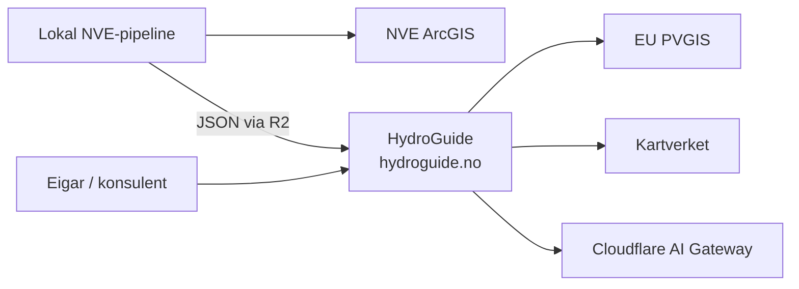

# HydroGuide

HydroGuide hjelper eigarar av små vasskraftverk med å oppfylle NVE-krava til minstevassføring og måling — typisk på avsidesliggjande lokasjonar utan straumnett eller fast samband. Appen hentar krav per kraftverk frå NVE-konsesjonsdokument, foreslår teknisk løysing for slepp og måling ut frå inntaksforhold, og dimensjonerer ein autonom måleinstallasjon: sol, batteri, reservekraft og radiolink for dataoverføring.

Live: [hydroguide.no](https://hydroguide.no) — API-dokumentasjon: [hydroguide.no/api/docs?ui](https://hydroguide.no/api/docs?ui)

## System



HydroGuide er ein React/Vite-frontend pluss fire Cloudflare Workers (api, report, ai, admin), to KV-namespaces og tre R2-buckets. NVE-konsesjonsdokument blir prosessert lokalt (OCR + LLM) og lasta opp som ferdig JSON. Soldata kjem frå PVGIS, terreng frå Kartverket, og rapporttekst frå Cloudflare AI Gateway.

Detaljert systemkontekst og containerdiagram: [docs/arkitektur.md](docs/arkitektur.md).

## Kva Som Ikkje Er Trivielt

For sensor og lesarar som vil sjå "kor jobben ligg":

- **Fire Workers med skild trust-grenser.** AI-Workeren har ingen offentleg URL — han blir berre kalla via service binding frå rapport-Workeren. Admin er fysisk skild frå offentleg API. Sjå [docs/arkitektur.md](docs/arkitektur.md) og [docs/sikkerheit.md](docs/sikkerheit.md).
- **Lokal NVE-pipeline med OCR og LLM.** PDF-konsesjonsdokument blir strukturerte til JSON med OpenDataLoader, EasyOCR og Ollama. Køyrer lokalt fordi Workers har 30s CPU-grense. Sjå [tools/minstevann/README.md](tools/minstevann/README.md).
- **Faktisk timesvis solanalyse** med horisontprofil frå Kartverket (360 retningar × 40 avstandar), batterisimulering time for time gjennom året, og kostnadssamanlikning over levetid mellom reservekjeldene. Berekningskjernen er delt mellom frontend og backend så API og UI ikkje kan kome ut av sync.
- **API-nøklar er HMAC-hash-a i KV.** Lekka KV-dump gir ikkje brukbare nøklar. Sjå [docs/sikkerheit.md](docs/sikkerheit.md).
- **WAF, rate limit, CSP, DNSSEC, TLS-strict, cache-bypass for `/api/*`.** Lagdelt forsvar gjennom Cloudflare-sona. Sjå [docs/sikkerheit.md](docs/sikkerheit.md).
- **Rapport-AI med fast retrieval.** Modellen *supplerer* faste reglar i KV — han tek ikkje avgjerder. Tekstgrense på 250 ord, retrieval-threshold 0.35, modell-fallback. Sjå [docs/ai-strategi.md](docs/ai-strategi.md).

## Struktur

```text
frontend/                     React/Vite-app
backend/
  api/                        Delte API-handlarar
  workers/                    Cloudflare Worker entrypoints (api, report, ai, admin)
  cloudflare/                 Wrangler-konfig per Worker
  services/ai/                Intern rapport-AI
  services/calculations/      Delt berekningskjerne (frontend + backend)
  data/minimumflow.json       Lokal kopi av minstevassføring per NVEID
  config/                     Generert/offentleg Cloudflare-metadata
  scripts/                    Vedlikehald for Cloudflare, R2 og KV
tools/
  minstevann/                 NVE-dokument -> minstevassføring -> NVEID
  horizon_pdf.py              Horisontprofil PDF-generator
  solar_position_pdf.py       Solposisjon PDF-generator
docs/                         Dokumentasjon
.ai/                          Lokal agent-dokumentasjon og worklog
```

## Kom I Gang

```bash
cd frontend
npm ci
npm run dev          # Vite på localhost:5173 med /api/* bridge til backend/api/
npm run build:test   # bygg og kopier til test-deploy/
```

Komplett oppsett, lokal API-bridge, pipeline, vanlege feil: [docs/utvikling.md](docs/utvikling.md).

## Minstevassføring (Pipeline)

```bash
python tools/minstevann/run.py plant 1696
python tools/minstevann/run.py batch --n 500
python tools/minstevann/run.py batch --resume
python tools/minstevann/run.py export
```

Detaljar (Ollama, OCR-oppsett, validering): [tools/minstevann/README.md](tools/minstevann/README.md).

## Dokumentasjon

| Tema | Dokument |
|------|----------|
| Onboarding for nye bidragsytarar | [docs/onboarding.md](docs/onboarding.md) |
| Arkitektur, dataflyt, tekniske val | [docs/arkitektur.md](docs/arkitektur.md) |
| Frontend (sider, tilstand, berekningsmodular) | [docs/frontend.md](docs/frontend.md) |
| Backend (domeneinndelt: berekning, NVEID, rapport, admin) | [docs/backend-dokumentasjon.md](docs/backend-dokumentasjon.md) |
| Cloudflare (workers, deploy, observability) | [docs/cloudflare-dokumentasjon.md](docs/cloudflare-dokumentasjon.md) |
| Sikkerheit (trusselbilete, forsvar i lag, kjende avgrensingar) | [docs/sikkerheit.md](docs/sikkerheit.md) |
| Rapport-AI runtime (retrieval, modell, bindingar) | [docs/ai-rapport.md](docs/ai-rapport.md) |
| AI-strategi (hallusinering, kostnad, prompt) | [docs/ai-strategi.md](docs/ai-strategi.md) |
| Lokal utvikling og vanlege feil | [docs/utvikling.md](docs/utvikling.md) |
| NVE-pipeline (OCR + LLM-strukturering) | [tools/minstevann/README.md](tools/minstevann/README.md) |

## Krav

- Node.js 22 LTS, npm 10+
- Python 3.13+ for `tools/minstevann/`
- Java 21 for OpenDataLoader/OCR i pipeline
- git-crypt (valfritt — for å lese `.secrets` og `cloudflare.private.json`)

## Ordliste

| Ord | Tyder |
|-----|-------|
| NVE | Noregs vassdrags- og energidirektorat — gir konsesjon for vasskraftverk |
| NVEID | NVE sin unike ID for eit kraftverk (eks. 1696) |
| Konsesjon | Løyve frå NVE til å drive vasskraftverk, med vilkår |
| Minstevassføring | Minste vassmengd som alltid må sleppast forbi inntaket |
| Slepp | Måten minstevassføringa blir sluppet forbi inntaket på |
| Måleinstallasjon | Utstyr i felt som måler at minstevassføringa held seg over kravet |
| Avsidesliggjande lokasjon | Inntak utan straumnett eller fast samband — typisk fjellet |

