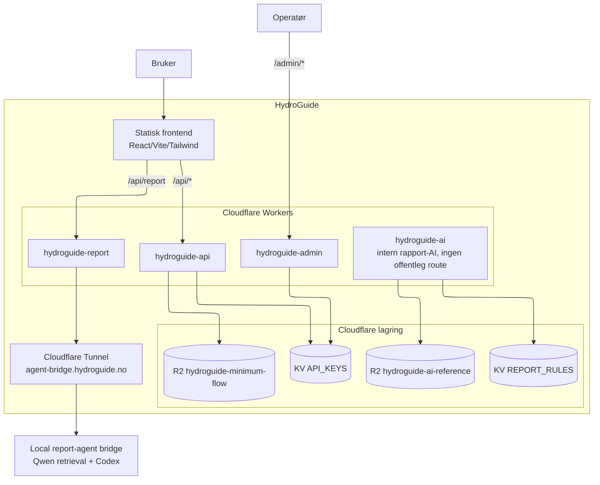

# HydroGuide

HydroGuide er laga for ingeniørar og konsulentar som jobbar med minstevassføring, målestasjonar og straumløysingar på stader utan vanleg nettilgang. Målet er å samle mykje av det praktiske på ein stad, slik at det blir lettare å jobbe systematisk og kome raskare fram til ei god fagleg vurdering.

  - Krav til dokumentasjon og instrumentering for minstevassføring er detaljerte, og det er lett å oversjå noko viktig.
  - Dimensjonering av energi til fjernstasjonar er ei vanleg feilkjelde, særleg dersom sol, batteri eller reserve blir for svakt dimensjonert.
  - HydroGuide er laga for å kutte ned på repetitivt arbeid og gi eit ryddigare utgangspunkt for vidare vurdering.

HydroGuide brukar API-ar frå NVE Atlas og Kartverket, saman med prosjektdata for sol og energibruk, for å hente inn grunnlag til analyse av vasskraftanlegg, planlegging av kommunikasjon og dimensjonering av off-grid energisystem.

Når du vel eit kraftverk, hentar HydroGuide inn anleggs- og konsesjonsdata frå NVE Atlas, mellom anna installert effekt, brutto fallhøgd, inntakskoordinatar, damplassering og krav til minstevassføring. Kartverket sine opne API-ar blir brukte til stadnamn, høgdedata, siktlinje for radio og vurdering av terreng og tilkomst.

Til energidimensjonering brukar HydroGuide månadlege prosjektverdiar for solinnstråling, paneloppsett, batteribank og reservekjelde. Det gir eit raskt overslag av energibalanse, batteristorleik, årskostnad og CO2 utan å køyre ein eigen timesimulering i frontend.

HydroGuide har ein intern modell for situasjonar der du vil gjere ei rask vurdering eller teste ulike scenario. Han passar godt tidleg i arbeidet eller som eit første overslag.

Live: [hydroguide.no](https://hydroguide.no) — API-dokumentasjon: [hydroguide.no/api](https://hydroguide.no/api)

## System



HydroGuide er en React/Vite-frontend pluss fire Cloudflare Workers (api, report, ai, admin), to KV-namespaces og tre R2-buckets. NVE-konsesjonsdokument blir prosessert lokalt (OCR + LLM) og lastet opp som ferdig JSON. Terrengdata kommer fra Kartverket, og rapporttekst går gjennom en lokal report-agent bridge med Qwen retrieval og Codex via CLIProxyAPI.

Detaljert systemkontekst og container-diagram: [docs/arkitektur-dokumentasjon.md](docs/arkitektur-dokumentasjon.md).

## Hva som ikke er trivielt

For sensor og lesere som vil se "hvor jobben ligger":

- **Fire Workers med skilte trust-grenser.** Rapport-Worker har offentlig `/api/report`, validerer access code og kaller lokal rapportagent via Cloudflare Tunnel. Admin-Worker ligger på `/admin/*`, mens WAF blokkerer `/api/keys*`. Se [docs/arkitektur-dokumentasjon.md](docs/arkitektur-dokumentasjon.md) og [docs/sikkerheit-dokumentasjon.md](docs/sikkerheit-dokumentasjon.md).
- **Lokal NVE-pipeline med OCR og LLM.** PDF-konsesjonsdokument blir strukturert til JSON med OpenDataLoader, EasyOCR og LM Studio. Kjører lokalt fordi Workers har 30s CPU-grense. Se [tools/minstevann/README.md](tools/minstevann/README.md).
- **Praktisk energidimensjonering** med månedlige solverdier, batteribank, reservekilde og kostnadssammenligning over levetid. Beregningskjernen er delt mellom frontend og backend så API og UI ikke kan komme ut av sync.
- **API-nøkler er HMAC-hash-et i KV.** Lekket KV-dump gir ikke brukbare nøkler. Se [docs/sikkerheit-dokumentasjon.md](docs/sikkerheit-dokumentasjon.md).
- **WAF, rate limit, CSP, DNSSEC, TLS-strict, cache-bypass for `/api/*`.** Lagdelt forsvar gjennom Cloudflare-sonen. Se [docs/sikkerheit-dokumentasjon.md](docs/sikkerheit-dokumentasjon.md).
- **Lokal rapportagent med fast retrieval.** Qwen embeddings henter relevante JSONL-kunnskapschunker, og Codex skriver et kontrollert rapporttillegg uten OpenAI API-key i repoet. Se [tools/agent-bridge/README.md](tools/agent-bridge/README.md).

## Struktur

```text
.
├── frontend/                   React/Vite-app
├── backend/
│   ├── api/                    Delte API-handlere
│   ├── workers/                Cloudflare Worker-entrypoints (api, report, ai, admin)
│   ├── cloudflare/             Wrangler-konfig per Worker
│   ├── services/
│   │   ├── ai/                 Intern rapport-AI
│   │   └── calculations/       Delt beregningskjerne (frontend + backend)
│   ├── data/
│   │   └── minimumflow.json    Lokal kopi av minstevannføring per NVEID
│   ├── config/                 Generert/offentlig Cloudflare-metadata
│   └── scripts/                Vedlikehold for Cloudflare, R2 og KV
├── tools/
│   ├── minstevann/             NVE-dokument -> minstevannføring -> NVEID
│   ├── horizon_pdf.py          Horisontprofil PDF-generator
│   └── solar_position_pdf.py   Solposisjon PDF-generator
├── docs/                       Dokumentasjon
└── .ai/                        Lokal agent-dokumentasjon og worklog
```

## Kom i gang

```bash
cd frontend
npm ci
npm run dev          # Vite på localhost:5173 med /api/* bridge til backend/api/
npm run build:test   # bygg og kopier til test-deploy/
```

Komplett oppsett, lokal API-bridge, pipeline, vanlige feil: [docs/utvikling-dokumentasjon.md](docs/utvikling-dokumentasjon.md).

## Minstevannføring (pipeline)

```bash
python tools/minstevann/run.py plant 1696
python tools/minstevann/run.py batch --n 500
```

Resultatet skrives til `backend/data/minimumflow.json`. Køyr `python tools/minstevann/run.py <kommando> --help` for alle flagg.

Detaljer (LM Studio, OCR-oppsett, validering): [tools/minstevann/README.md](tools/minstevann/README.md).

## Dokumentasjon

| Tema | Dokument |
|------|----------|
| Lokal utvikling og oppsett | [docs/utvikling-dokumentasjon.md](docs/utvikling-dokumentasjon.md) |
| Arkitektur, dataflyt, tekniske valg | [docs/arkitektur-dokumentasjon.md](docs/arkitektur-dokumentasjon.md) |
| Frontend (sider, tilstand, beregningsmoduler) | [docs/frontend-dokumentasjon.md](docs/frontend-dokumentasjon.md) |
| Backend (domeneinndelt: beregning, NVEID, rapport, admin) | [docs/backend-dokumentasjon.md](docs/backend-dokumentasjon.md) |
| Cloudflare (workers, deploy, observability) | [docs/cloudflare-dokumentasjon.md](docs/cloudflare-dokumentasjon.md) |
| Sikkerhet (trusselbilde, forsvar i lag, kjente begrensninger) | [docs/sikkerheit-dokumentasjon.md](docs/sikkerheit-dokumentasjon.md) |
| Lokal rapportagent (retrieval, Codex bridge, runtime) | [tools/agent-bridge/README.md](tools/agent-bridge/README.md) |
| AI-strategi (hallusinering, kostnad, prompt) | [docs/ai-strategi-dokumentasjon.md](docs/ai-strategi-dokumentasjon.md) |
| NVE-pipeline (OCR + LLM-strukturering) | [tools/minstevann/README.md](tools/minstevann/README.md) |

## Krav

- Node.js 22 LTS, npm 10+
- Python 3.13+ for `tools/minstevann/`
- Java 21 for OpenDataLoader/OCR i pipeline
- git-crypt (valgfritt — for å lese `.secrets` og `cloudflare.private.json`)

## Ordliste

| Ord | Betyr |
|-----|-------|
| NVE | Norges vassdrags- og energidirektorat — gir konsesjon for vannkraftverk |
| NVEID | NVE sin unike ID for et kraftverk (eks. 1696) |
| Konsesjon | Tillatelse fra NVE til å drive vannkraftverk, med vilkår |
| Minstevannføring | Minste vannmengde som alltid må slippes forbi inntaket |
| Slipp | Måten minstevannføringen blir sluppet forbi inntaket på |
| Måleinstallasjon | Utstyr i felt som måler at minstevannføringen holder seg over kravet |
| Avsidesliggende lokasjon | Inntak uten strømnett eller fast samband — typisk fjellet |
