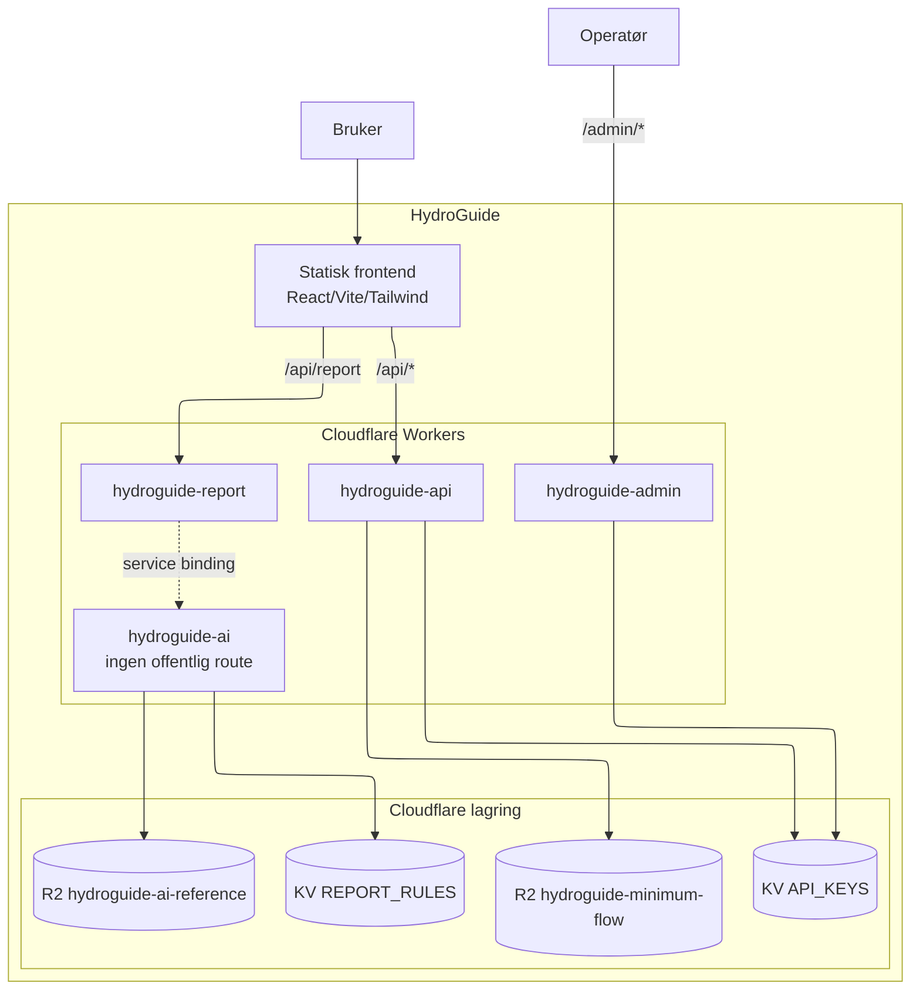

# HydroGuide

HydroGuide er laga for ingeniørar og konsulentar som jobbar med minstevassføring, målestasjonar og straumløysingar på stader utan vanleg nettilgang. Målet er å samle mykje av det praktiske på ein stad, slik at det blir lettare å jobbe systematisk og kome raskare fram til ei god fagleg vurdering.
Krav til dokumentasjon og instrumentering for minstevassføring er detaljerte, og det er lett å oversjå noko viktig.
Dimensjonering av energi til fjernstasjonar er ei vanleg feilkjelde, særleg dersom sol, batteri eller reserve blir for svakt dimensjonert.
HydroGuide er laga for å kutte ned på repetitivt arbeid og gi eit ryddigare utgangspunkt for vidare vurdering.
HydroGuide brukar API-ar frå NVE Atlas og Kartverket, saman med lokale PVGIS 6.0-data, for å hente inn grunnlag til analyse av vasskraftanlegg, planlegging av kommunikasjon og dimensjonering av off-grid energisystem.
Når du vel eit kraftverk, hentar HydroGuide inn anleggs- og konsesjonsdata frå NVE Atlas, mellom anna installert effekt, brutto fallhøgd, inntakskoordinatar, damplassering og krav til minstevassføring. Kartverket sine opne API-ar blir brukte til stadnamn, høgdedata, horisontprofil, siktlinje for radio og vurdering av terreng og tilkomst.
Til energidimensjonering brukar HydroGuide eit lokalt PVGIS 6.0 TMY-grunnlag med 8 760 timeverdiar for innstråling, temperatur og vind. Solproduksjonen blir rekna med PVGIS 6.0, der det også blir teke omsyn til horisont, innfallsvinkel og temperatur i solcellene. Til saman gir dette ei meir realistisk vurdering av korleis sol og batteri vil oppføre seg gjennom året.
HydroGuide har også ein enklare intern modell for situasjonar der du berre vil gjere ei rask vurdering eller teste ulike scenario. Han passar godt tidleg i arbeidet eller som eit første overslag. I mange tilfelle er det naturleg å starte der, og heller gå vidare til full simulering når du treng meir detaljar.

Live: [hydroguide.no](https://hydroguide.no) — API-dokumentasjon: [hydroguide.no/api/docs?ui](https://hydroguide.no/api/docs?ui)

## System



HydroGuide er en React/Vite-frontend pluss fire Cloudflare Workers (api, report, ai, admin), to KV-namespaces og tre R2-buckets. NVE-konsesjonsdokument blir prosessert lokalt (OCR + LLM) og lastet opp som ferdig JSON. Soldata kommer fra PVGIS, terreng fra Kartverket, og rapporttekst fra Cloudflare AI Gateway.

Detaljert systemkontekst og container-diagram: [docs/arkitektur.md](docs/arkitektur.md).

## Hva som ikke er trivielt

For sensor og lesere som vil se "hvor jobben ligger":

- **Fire Workers med skilte trust-grenser.** AI-Worker har ingen offentlig URL — den blir bare kalt via service binding fra rapport-Worker. Admin er fysisk skilt fra offentlig API. Se [docs/arkitektur.md](docs/arkitektur.md) og [docs/sikkerheit.md](docs/sikkerheit.md).
- **Lokal NVE-pipeline med OCR og LLM.** PDF-konsesjonsdokument blir strukturert til JSON med OpenDataLoader, EasyOCR og Ollama. Kjører lokalt fordi Workers har 30s CPU-grense. Se [tools/minstevann/README.md](tools/minstevann/README.md).
- **Faktisk timesvis solanalyse** med horisontprofil fra Kartverket (360 retninger × 40 avstander), batterisimulering time for time gjennom året, og kostnadssammenligning over levetid mellom reservekildene. Beregningskjernen er delt mellom frontend og backend så API og UI ikke kan komme ut av sync.
- **API-nøkler er HMAC-hash-et i KV.** Lekket KV-dump gir ikke brukbare nøkler. Se [docs/sikkerheit.md](docs/sikkerheit.md).
- **WAF, rate limit, CSP, DNSSEC, TLS-strict, cache-bypass for `/api/*`.** Lagdelt forsvar gjennom Cloudflare-sonen. Se [docs/sikkerheit.md](docs/sikkerheit.md).
- **Rapport-AI med fast retrieval.** Modellen *supplerer* faste regler i KV — den tar ikke avgjørelser. Tekstgrense på 250 ord, retrieval-threshold 0.35, modell-fallback. Se [docs/ai-strategi.md](docs/ai-strategi.md).

## Struktur

```text
.
├── frontend/                   React/Vite-app
├── backend/
│   ├── api/                    Delte API-handlere
│   ├── workers/                Cloudflare Worker-entrypoints (api, report, ai, admin)
│   ├── cloudflare/             Wrangler-konfig per Worker
│   ├── services/
│   │   ├── ai/                 Intern rapport-AI
│   │   └── calculations/       Delt beregningskjerne (frontend + backend)
│   ├── data/
│   │   └── minimumflow.json    Lokal kopi av minstevannføring per NVEID
│   ├── config/                 Generert/offentlig Cloudflare-metadata
│   └── scripts/                Vedlikehold for Cloudflare, R2 og KV
├── tools/
│   ├── minstevann/             NVE-dokument -> minstevannføring -> NVEID
│   ├── horizon_pdf.py          Horisontprofil PDF-generator
│   └── solar_position_pdf.py   Solposisjon PDF-generator
├── docs/                       Dokumentasjon
└── .ai/                        Lokal agent-dokumentasjon og worklog
```

## Kom i gang

```bash
cd frontend
npm ci
npm run dev          # Vite på localhost:5173 med /api/* bridge til backend/api/
npm run build:test   # bygg og kopier til test-deploy/
```

Komplett oppsett, lokal API-bridge, pipeline, vanlige feil: [docs/utvikling.md](docs/utvikling.md).

## Minstevannføring (pipeline)

```bash
python tools/minstevann/run.py plant 1696
python tools/minstevann/run.py batch --n 500
python tools/minstevann/run.py batch --resume
python tools/minstevann/run.py export
```

Detaljer (Ollama, OCR-oppsett, validering): [tools/minstevann/README.md](tools/minstevann/README.md).

## Dokumentasjon

| Tema | Dokument |
|------|----------|
| Lokal utvikling og oppsett | [docs/utvikling.md](docs/utvikling.md) |
| Arkitektur, dataflyt, tekniske valg | [docs/arkitektur.md](docs/arkitektur.md) |
| Frontend (sider, tilstand, beregningsmoduler) | [docs/frontend.md](docs/frontend.md) |
| Backend (domeneinndelt: beregning, NVEID, rapport, admin) | [docs/backend-dokumentasjon.md](docs/backend-dokumentasjon.md) |
| Cloudflare (workers, deploy, observability) | [docs/cloudflare-dokumentasjon.md](docs/cloudflare-dokumentasjon.md) |
| Sikkerhet (trusselbilde, forsvar i lag, kjente begrensninger) | [docs/sikkerheit.md](docs/sikkerheit.md) |
| Rapport-AI runtime (retrieval, modell, bindinger) | [docs/ai-rapport.md](docs/ai-rapport.md) |
| AI-strategi (hallusinering, kostnad, prompt) | [docs/ai-strategi.md](docs/ai-strategi.md) |
| NVE-pipeline (OCR + LLM-strukturering) | [tools/minstevann/README.md](tools/minstevann/README.md) |

## Krav

- Node.js 22 LTS, npm 10+
- Python 3.13+ for `tools/minstevann/`
- Java 21 for OpenDataLoader/OCR i pipeline
- git-crypt (valgfritt — for å lese `.secrets` og `cloudflare.private.json`)

## Ordliste

| Ord | Betyr |
|-----|-------|
| NVE | Norges vassdrags- og energidirektorat — gir konsesjon for vannkraftverk |
| NVEID | NVE sin unike ID for et kraftverk (eks. 1696) |
| Konsesjon | Tillatelse fra NVE til å drive vannkraftverk, med vilkår |
| Minstevannføring | Minste vannmengde som alltid må slippes forbi inntaket |
| Slipp | Måten minstevannføringen blir sluppet forbi inntaket på |
| Måleinstallasjon | Utstyr i felt som måler at minstevannføringen holder seg over kravet |
| Avsidesliggende lokasjon | Inntak uten strømnett eller fast samband — typisk fjellet |
