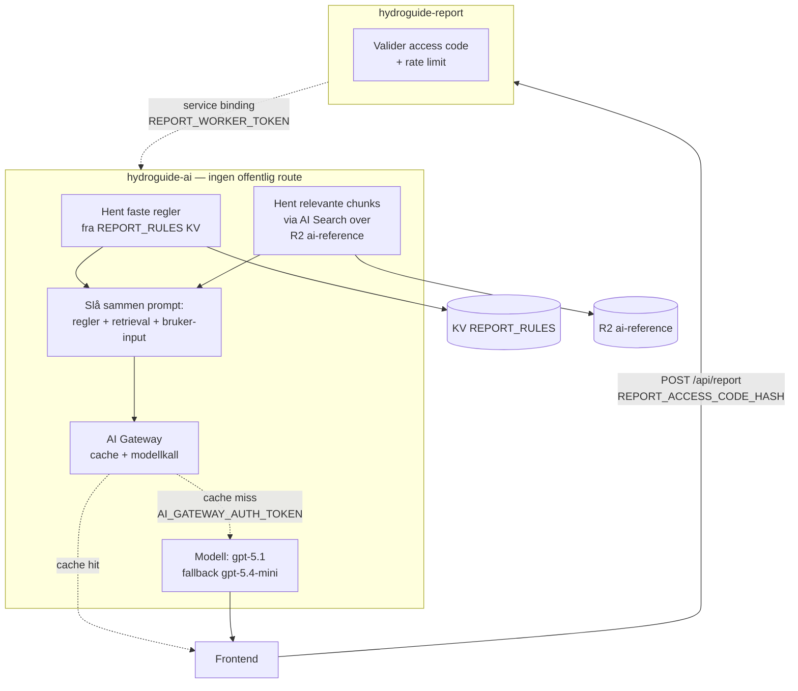

# Rapport-AI (runtime)

Oppdatert: 2026-05-03

Rapport-AI er den AI-baserte tekstgenereringen som kjører i Cloudflare når nettsiden ber om en rapport. Den er bygget opp av to Workers, Worker-bindinger, KV/R2-data og ett eksternt LLM-kall via Cloudflare AI Gateway.

For overordnet AI-strategi, modellrolle og kostnad: se [ai-strategi.md](ai-strategi.md).
For pipeline som forbereder grunnlagsdata: se [tools/minstevann/README.md](../tools/minstevann/README.md).

## Flyt



`hydroguide-report` validerer access code og rate-limiter. `hydroguide-report` kaller `hydroguide-ai` via `REPORT_AI_WORKER`. `hydroguide-ai` bygger prompt fra retrieval-kilder og brukerdata, kaller modell via AI Gateway og returnerer rapporttekst med modell-, gateway-, retrieval- og evidence-metadata.

## Bindinger

| Binding | Type | Bruk |
|---------|------|------|
| `REPORT_AI_WORKER` | Service binding | Internt kall fra `hydroguide-report` til `hydroguide-ai` |
| `REPORT_ACCESS_CODE_HASH` | Secret | Tilgangskode fra nettsiden til report-Worker |
| `REPORT_WORKER_TOKEN` | Secret | Intern bearer mellom report og AI |
| `AI` | Cloudflare AI binding | Native Workers AI-tilgang (`remote: true`) |
| `REPORT_RULES` | KV | Rapportregler og faste NVE-utdrag |
| `AI_REFERENCE_BUCKET` | R2 | Referanser og embeddings |
| `AI_GATEWAY_AUTH_TOKEN` | Secret | Tilgang til AI Gateway |
| `AI_SEARCH_API_TOKEN` | Secret | Tilgang til AI Search |

## Retrieval

Rapport-AI henter grunnlag fra tre kilder:

1. **`REPORT_RULES` KV** — faste regler og korte NVE-utdrag.
2. **`AI_REFERENCE_BUCKET` R2 via AI Search** — NVE-referanser og embeddings. AI Search returnerer de mest relevante chunkene for hver forespørsel.
3. **Direkte konfig-verdier** fra bruker-input som blir lagt inn i prompten med faste seksjonsgrenser.

Retrieval-konfig (fra `backend/cloudflare/ai.wrangler.jsonc`):

```text
RETRIEVAL_BACKEND        auto
RETRIEVAL_STRATEGY       auto
AI_SEARCH_ACCOUNT_ID     REPLACE_WITH_ACCOUNT_ID
AI_SEARCH_INSTANCE       ai-search
AI_SEARCH_MAX_RESULTS    10
AI_SEARCH_MATCH_THRESHOLD 0.35
AI_SEARCH_ENABLE_RERANKING true
AI_SEARCH_ENABLE_QUERY_REWRITE false
```

Reranking er aktivert. Query-rewrite er deaktivert.

## Modell

Standard config:

| Verdi | Innstilling |
|-------|-------------|
| Primærmodell | `gpt-5.1` |
| Fallback | `gpt-5.4-mini` |
| AI Gateway | `AI_GATEWAY_ENABLED=true` |
| AI Gateway account | `AI_GATEWAY_ACCOUNT_ID` |
| AI Gateway ID | `hydroguide-ai-gateway` |
| Cache TTL | 3600 sekunder |
| Request timeout | 8000 ms |
| Max attempts | 3 |
| Retry delay | 500 ms (eksponensiell backoff) |

Cache TTL er 1 time for like rapportforespørsler.

## Tekstgenerering

Rapportteksten styres av narrative runtime-verdier:

| Verdi | Innstilling |
|-------|-------------|
| `NARRATIVE_MODE` | `supplement` |
| `NARRATIVE_MAX_WORDS` | 250 |
| `NARRATIVE_MAX_SENTENCES` | 10 |

Strategi for modellrolle og prompt-grenser: [ai-strategi.md](ai-strategi.md).

## ALLOWED_ORIGINS

Rapport-AI godtar kall bare fra:

- `https://hydroguide.no`
- `https://www.hydroguide.no`
- `http://127.0.0.1:5173`, `http://localhost:5173` (lokal dev)

`ALLOWED_ORIGINS` begrenser HTTP-kall. Service binding brukes for interne kall mellom `hydroguide-report` og `hydroguide-ai`.

## Runtime-flagg

| Flagg | Source-config | Bruk |
|-------|---------------|------|
| `SELF_FEEDBACK_ENABLED` | `false` | `hydroguide-ai` kjører self-feedback når flagget er `true`. |
| `USER_FEEDBACK_ENABLED` | `false` | `hydroguide-ai` lager feedback-token når flagget er `true`. |
| `VECTORIZE_ENABLED` | `false` | Vectorize-kode finnes for upload, batch-embed og retrieval. Den brukes når `VECTORIZE_ENABLED=true`, `VECTORIZE_INDEX` er bundet og `AI` er tilgjengelig. |

AI Search brukes når `AI_SEARCH_INSTANCE` og `AI`/REST-token er konfigurert. KV brukes som fallback der retrieval-koden ikke finner gyldige søketreff.

## Se også

- AI-strategi (modellrolle, kostnad, prompt-mønster): [ai-strategi.md](ai-strategi.md)
- Pipeline som genererer NVE-data: [tools/minstevann/README.md](../tools/minstevann/README.md)
- Endepunkter og handler: [backend-dokumentasjon.md](backend-dokumentasjon.md)
- Worker-konfig og deploy: [cloudflare-dokumentasjon.md](cloudflare-dokumentasjon.md)
- Trusselbilde (prompt-injection osv.): [sikkerheit.md](sikkerheit.md)
