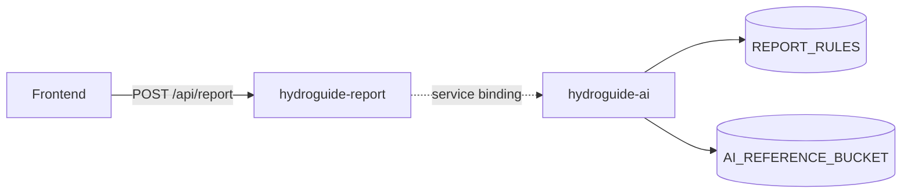

# Rapport-AI (runtime)

Oppdatert: 2026-05-03

Rapport-AI er den AI-baserte tekstgenereringen som kjører i Cloudflare når nettsiden ber om en rapport. Den er bygget opp av to Workers, fire bindinger og ett eksternt LLM-kall via Cloudflare AI Gateway.

For overordnet AI-strategi (hvorfor LLM, hvordan vi unngår at modellen finner på ting, kostnad): se [ai-strategi.md](ai-strategi.md).
For pipeline som forbereder grunnlagsdata: se [tools/minstevann/README.md](../tools/minstevann/README.md).

## Flyt



`hydroguide-report` validerer access code fra nettsiden, sjekker rate limit, og kaller AI-Worker via service binding med `REPORT_WORKER_TOKEN`. AI-Worker henter retrieval-grunnlag fra `REPORT_RULES` (faste regler) og `AI_REFERENCE_BUCKET` (NVE-referanser via AI Search), bygger prompt og kaller modell via Cloudflare AI Gateway. Resultatet `{ text }` returneres til frontend som rendrer HTML-rapport.

`hydroguide-ai` har ingen offentlig route. `hydroguide-report` kaller den med service binding.

## Bindinger

| Binding | Type | Bruk |
|---------|------|------|
| `REPORT_AI_WORKER` | Service binding | Internt kall fra `hydroguide-report` til `hydroguide-ai` |
| `REPORT_ACCESS_CODE_HASH` | Secret | Tilgangskode fra nettsiden til report-Worker |
| `REPORT_WORKER_TOKEN` | Secret | Intern bearer mellom report og AI |
| `AI` | Cloudflare AI binding | Native Workers AI-tilgang (`remote: true`) |
| `REPORT_RULES` | KV | Rapportregler og faste NVE-utdrag |
| `AI_REFERENCE_BUCKET` | R2 | Referanser og embeddings |
| `AI_GATEWAY_AUTH_TOKEN` | Secret | Tilgang til AI Gateway |
| `AI_SEARCH_API_TOKEN` | Secret | Tilgang til AI Search |

## Retrieval

Rapport-AI henter grunnlag fra tre kilder, i stigende rekkefølge av "fasthet":

1. **`REPORT_RULES` KV** — faste regler og korte utdrag som *alltid* skal være med. Dette er den mest tillitsfulle kilden.
2. **`AI_REFERENCE_BUCKET` R2 via AI Search** — NVE-referanser og embeddings. AI Search returnerer de mest relevante chunkene for hver forespørsel.
3. **Direkte konfig-verdier** fra bruker-input som blir sluppet inn i prompten med klare avgrensninger.

Retrieval-konfig (fra `backend/cloudflare/ai.wrangler.jsonc`):

```text
RETRIEVAL_BACKEND        auto
RETRIEVAL_STRATEGY       auto
AI_SEARCH_INSTANCE       ai-search
AI_SEARCH_MAX_RESULTS    10
AI_SEARCH_MATCH_THRESHOLD 0.35
AI_SEARCH_ENABLE_RERANKING true
AI_SEARCH_ENABLE_QUERY_REWRITE false
```

Reranking er på, query-rewrite er av — modellen skal ikke omformulere bruker-spørsmål inn i retrieval-laget.

## Modell

Standard config:

| Verdi | Innstilling |
|-------|-------------|
| Primærmodell | `gpt-5.1` |
| Fallback | `gpt-5.4-mini` |
| AI Gateway ID | `hydroguide-ai-gateway` |
| Cache TTL | 3600 sekunder |
| Request timeout | 8000 ms |
| Max attempts | 3 |
| Retry delay | 500 ms (eksponensiell backoff) |

Cache TTL på 1 time gir billige treff på like rapporter (samme NVEID, samme input).

## Tekstgenereringsbegrensninger

For å hindre at modellen "finner på" eller skriver lange essay:

| Verdi | Innstilling |
|-------|-------------|
| `NARRATIVE_MODE` | `supplement` (skal *supplere* faste regler, ikke erstatte) |
| `NARRATIVE_MAX_WORDS` | 250 |
| `NARRATIVE_MAX_SENTENCES` | 10 |

Detaljert begrunnelse: [ai-strategi.md](ai-strategi.md).

## ALLOWED_ORIGINS

Rapport-AI godtar kall bare fra:

- `https://hydroguide.no`
- `https://www.hydroguide.no`
- `http://127.0.0.1:5173`, `http://localhost:5173` (lokal dev)

Dette er ekstra bekreftelse på toppen av service binding (som hindrer offentlige HTTP-kall helt).

## Hva ikke er på

| Funksjon | Status |
|----------|--------|
| `SELF_FEEDBACK_ENABLED` | false — modellen vurderer ikke sin egen output |
| `USER_FEEDBACK_ENABLED` | false — vi tar ikke bruker-tilbakemelding inn i loop |
| `VECTORIZE_ENABLED` | false — vi bruker AI Search, ikke Vectorize |

Disse er bevisst slått av. Se [ai-strategi.md](ai-strategi.md) for hvorfor.

## Se også

- AI-strategi (hallusinering, kostnad, prompt-mønster): [ai-strategi.md](ai-strategi.md)
- Pipeline som genererer NVE-data: [tools/minstevann/README.md](../tools/minstevann/README.md)
- Endepunkter og handler: [backend-dokumentasjon.md](backend-dokumentasjon.md)
- Worker-konfig og deploy: [cloudflare-dokumentasjon.md](cloudflare-dokumentasjon.md)
- Trusselbilde (prompt-injection osv.): [sikkerheit.md](sikkerheit.md)
