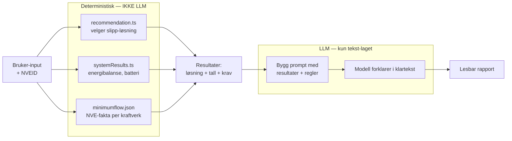

# AI-strategi

Oppdatert: 2026-05-03

Dette dokumentet svarer på "hvorfor bruker HydroGuide AI i det hele tatt, og hvordan hindrer vi at det går galt". Konkret runtime-config finnes i [ai-rapport.md](ai-rapport.md).

## Hvorfor LLM i det hele tatt

LLM blir brukt to steder:

1. **Rapport-AI (runtime).** Genererer den lesbare delen av rapporten — forklarer valg og anbefalinger i klart språk.
2. **Pipeline (offline).** Strukturerer NVE-konsesjonsdokument til JSON med minstevannføringskrav.

For begge gjelder: regelmotorene (recommendation, calculation core, NVE-vilkår) er deterministiske. AI er supplement — den skriver klartekst og hjelper å hente struktur ut av PDF — den tar ikke avgjørelser.

## Hva vi ikke bruker LLM til

LLM lager tekst rundt resultater; LLM produserer ikke resultater. Avgjørelser om slipp, energibalanse og NVE-krav er deterministiske — de samme inputene gir alltid samme output. LLM oversetter resultatene til lesbar prosa, ingenting mer.

## Hvordan vi hindrer hallusinering

| Mottiltak | Hvordan |
|-----------|---------|
| Faste utdrag i `REPORT_RULES` | Faste, redigerte tekstbiter som modellen *skal* støtte seg på framfor å improvisere |
| `NARRATIVE_MODE: supplement` | Eksplisitt at modellen skal supplere, ikke erstatte |
| `NARRATIVE_MAX_WORDS: 250` | Kort tekst gir mindre rom for å vandre vekk |
| `NARRATIVE_MAX_SENTENCES: 10` | Hard struktur-grense |
| Retrieval med threshold | `AI_SEARCH_MATCH_THRESHOLD: 0.35` — kutter svake treff |
| `AI_SEARCH_ENABLE_QUERY_REWRITE: false` | Vi vil ikke at modellen skal omformulere brukerspørsmålet før retrieval |
| Reranking på | `AI_SEARCH_ENABLE_RERANKING: true` — best-match-treff først |
| Modell-fallback | `gpt-5.4-mini` om primærmodell feiler — vi får alltid et svar, ikke en fantasi-tekst |

## Hvordan vi hindrer prompt-injection

NVE-tekst går inn i prompten. Bruker-input går inn i prompten. Begge er angrepsvektorer.

| Mottiltak | Hvordan |
|-----------|---------|
| `ALLOWED_ORIGINS` på AI-Worker | Bare `hydroguide.no` og lokal dev kan i det hele tatt kalle Worker-en |
| `REPORT_ACCESS_CODE_HASH` | Validerer at kallet kommer fra nettsiden, ikke direkte |
| Service binding | AI-Worker har ingen offentlig URL — direkte kall er ikke mulig |
| Klare seksjonsmarkører i prompten | NVE-tekst og bruker-input ligger i tydelige blokker, ikke blandet inn i instruksjonen |
| Kort output-grense | Selv om modellen blir ledet på avveie, kan den ikke skrive 5000 ord med skadelig tekst |

Vi har **ikke** en automatisk prompt-injection-detektor. Det er en kjent begrensning — se [sikkerheit.md](sikkerheit.md).

## Kostnad og latens

AI-Gateway gir oss tre verktøy:

1. **Cache** (TTL 3600s). Samme input → cache-treff → ingen modell-kall. Kostnad 0, latens ~50ms.
2. **Retry med eksponensiell backoff.** Inntil 3 forsøk, 500ms initial delay.
3. **Timeout** på 8000ms. Vi blokkerer ikke brukeren i mer enn 8 sekunder per forsøk.

For en typisk rapport (under 250 ord, primærmodell `gpt-5.1`) er kostnaden i størrelsesorden et par øre per request før cache. Med cache-treff på like rapporter faller det videre.

Vi måler i Cloudflare AI Gateway-dashbordet:
- Cache-treff-prosent
- Gjennomsnittlig latens
- Kostnad per dag/måned
- Modell-fordeling (primær vs fallback)

## Hvorfor AI Search og ikke Vectorize

Begge er Cloudflare-tjenester for vektor-søk over dokumenter, men de jobber på ulikt nivå.

**AI Search** er en høynivå "AutoRAG"-tjeneste. Vi peker den på en R2-bucket med dokumenter, og den tar seg av resten automatisk: lager embeddings, lagrer dem, gir oss et søke-API som returnerer mest relevante chunkene. Vi sender en spørring, vi får tilbake tekst-utdrag.

**Vectorize** er en lavnivå vector-database. Vi må selv lage embeddings (kall en embedding-modell), laste dem opp, definere indeks-strukturen, og kalle similarity-search-API-et. Mer fleksibelt, men mye mer arbeid.

For HydroGuide har vi:
- `hydroguide-ai-reference` (R2-bucket): NVE-konsesjonsdokument og referanse-tekster
- `REPORT_RULES` (KV): faste regler og korte utdrag

Vi vektoriserer faktisk disse — men gjennom AI Search, som gjør jobben automatisk for oss. `VECTORIZE_ENABLED: false` betyr "vi bruker ikke det manuelle Vectorize-API-et", ikke "vi gjør ikke vector-søk".

Grunner til valget:
- AI Search er ferdig oppsatt — embedding, lagring, søk og reranking i én tjeneste.
- Vectorize ville krevd at vi bygger embedding-pipeline selv, holder den synkronisert med R2, og vedlikeholder relevans-scoring.
- For ~600 NVEID-er og en dokumentsamling som oppdateres sjelden, er AI Search billigere i både tid og penger.

Vectorize ville blitt aktuelt hvis dokumentsamlingen vokste til mange tusen dynamiske dokumenter, eller hvis vi trengte spesialtilpasset embedding-modell eller scoring-logikk.

## Hvorfor self-feedback og user-feedback er av

`SELF_FEEDBACK_ENABLED: false` og `USER_FEEDBACK_ENABLED: false`. Grunn:

- **Self-feedback** (modellen vurderer egen output) er svært dyrt — koster nesten dobbelt så mye per request — og gir liten verdiøkning når output allerede er <250 ord og bygget på faste regler.
- **User-feedback** (samle "var dette nyttig?") krever en tilbakemeldingssløyfe og lagring vi ikke har designet for. Det blir aktuelt i en senere versjon.

Begge er deaktivert via config-flagg, ikke via fjerning fra kode. Lett å snu på ved behov.

## Hvorfor pipeline er lokal, ikke Worker

Pipeline-en (`tools/minstevann/`) kjører lokalt med Java 21, Python 3.13, Ollama og OpenDataLoader.

Grunn:

- OCR + LLM-strukturering tar minutter per dokument. Cloudflare Workers har 30s CPU-grense per request.
- Modellen vi bruker lokalt (`gemma4:e4b-it-q4_K_M` via Ollama) er mye billigere per kall enn Cloudflare AI Gateway, og dette er batch-kjøring der latens ikke betyr noe.
- Output er statisk JSON som blir lastet opp én gang til R2. Ingen grunn til å re-prosessere på request-tid.

Pipeline-kjøring og output-validering: [tools/minstevann/README.md](../tools/minstevann/README.md).

## Kjente begrensninger

Se [sikkerheit.md#kjente-begrensninger](sikkerheit.md#kjente-begrensninger) for full liste. Spesifikt for AI:

- Pipeline-output blir manuelt sjekket, ikke automatisk validert mot skjema.
- Vi har ingen prompt-injection-detektor, bare tekstgrense-mottiltak.
- Per-API-nøkkel rate limit på rapport-AI er ikke på plass — bare Cloudflare per-IP rate limit.

## Se også

- Runtime-config og bindinger: [ai-rapport.md](ai-rapport.md)
- Pipeline-detaljer: [tools/minstevann/README.md](../tools/minstevann/README.md)
- Trusselbilde (prompt-injection, AI-misbruk): [sikkerheit.md](sikkerheit.md)
- Worker-deploy og secrets: [cloudflare-dokumentasjon.md](cloudflare-dokumentasjon.md)
