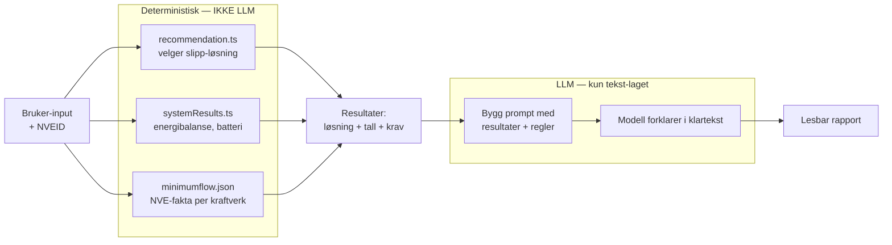

# AI-strategi

Oppdatert: 2026-05-03

Dette dokumentet beskriver hvor HydroGuide bruker AI, hvilken rolle modellen har, og hvilke grenser som ligger rundt modellkallene. Konkret runtime-config finnes i [ai-rapport.md](ai-rapport.md).

## LLM-bruk

LLM blir brukt to steder:

1. **Rapport-AI (runtime).** Genererer den lesbare delen av rapporten — forklarer valg og anbefalinger i klart språk.
2. **Pipeline (offline).** Strukturerer NVE-konsesjonsdokument til JSON med minstevannføringskrav.

For begge gjelder: regelmotorene (recommendation, calculation core, NVE-vilkår) er deterministiske. AI er supplement — den skriver klartekst og hjelper å hente struktur ut av PDF — den tar ikke avgjørelser.

## Hva vi ikke bruker LLM til

LLM lager tekst rundt resultater; LLM produserer ikke resultater. Avgjørelser om slipp, energibalanse og NVE-krav er deterministiske — de samme inputene gir alltid samme output. LLM oversetter resultatene til lesbar prosa, ingenting mer.

## Modellgrenser

| Mottiltak | Hvordan |
|-----------|---------|
| Faste utdrag i `REPORT_RULES` | Faste, redigerte tekstbiter som legges inn i prompten |
| `NARRATIVE_MODE: supplement` | Modellen skriver supplerende tekst rundt deterministiske resultater |
| `NARRATIVE_MAX_WORDS: 250` | Øvre ordgrense for rapportteksten |
| `NARRATIVE_MAX_SENTENCES: 10` | Hard struktur-grense |
| Retrieval med threshold | `AI_SEARCH_MATCH_THRESHOLD: 0.35` — kutter svake treff |
| `AI_SEARCH_ENABLE_QUERY_REWRITE: false` | Brukerspørsmålet sendes til retrieval uten query rewrite |
| Reranking på | `AI_SEARCH_ENABLE_RERANKING: true` — best-match-treff først |
| Modell-fallback | `gpt-5.4-mini` brukes når primærmodell feiler |

## Prompt-injection

NVE-tekst går inn i prompten. Bruker-input går inn i prompten. Begge er angrepsvektorer.

| Mottiltak | Hvordan |
|-----------|---------|
| `ALLOWED_ORIGINS` på AI-Worker | Tillatte origins er `hydroguide.no`, `www.hydroguide.no` og lokal dev |
| `REPORT_ACCESS_CODE_HASH` | Validerer at kallet kommer fra nettsiden, ikke direkte |
| Service binding | AI-Worker har ingen offentlig URL — direkte kall er ikke mulig |
| Klare seksjonsmarkører i prompten | NVE-tekst og bruker-input ligger i tydelige blokker, ikke blandet inn i instruksjonen |
| Kort output-grense | Output er begrenset av `NARRATIVE_MAX_WORDS` og `NARRATIVE_MAX_SENTENCES` |

Vi har **ikke** en automatisk prompt-injection-detektor. Det er en kjent begrensning — se [sikkerheit.md](sikkerheit.md).

## Kostnad og latens

AI-Gateway gir oss tre verktøy:

1. **Cache** (TTL 3600s). Samme input → cache-treff → ingen modell-kall. Kostnad 0, latens ~50ms.
2. **Retry med eksponensiell backoff.** Inntil 3 forsøk, 500ms initial delay.
3. **Timeout** på 8000ms. Vi blokkerer ikke brukeren i mer enn 8 sekunder per forsøk.

For en typisk rapport (under 250 ord, primærmodell `gpt-5.1`) er kostnaden i størrelsesorden et par øre per request før cache. Med cache-treff på like rapporter faller det videre.

Vi måler i Cloudflare AI Gateway-dashbordet:
- Cache-treff-prosent
- Gjennomsnittlig latens
- Kostnad per dag/måned
- Modell-fordeling (primær vs fallback)

## Retrieval-lag

Rapport-AI bruker `REPORT_RULES` KV, `AI_REFERENCE_BUCKET` R2 og AI Search. AI Search er konfigurert med `AI_SEARCH_INSTANCE=ai-search`, `AI_SEARCH_ENABLE_RERANKING=true` og `AI_SEARCH_ENABLE_QUERY_REWRITE=false`.

Vectorize-støtte finnes i `backend/services/ai/index.ts` og `backend/services/ai/retrieval.ts`. Upload- og batch-embed-rutene kan lagre embeddings i R2 og upserte til Vectorize når `VECTORIZE_ENABLED=true` og `VECTORIZE_INDEX` er bundet. Retrieval velger hybrid, Vectorize, AI Search eller KV ut fra `RETRIEVAL_STRATEGY`, `VECTORIZE_ENABLED`, `VECTORIZE_INDEX`, `AI_SEARCH_INSTANCE` og `AI`.

Source-config i `backend/cloudflare/ai.wrangler.jsonc` setter `VECTORIZE_ENABLED=false`. Koden bruker AI Search når `AI_SEARCH_INSTANCE` er konfigurert og faller tilbake til KV ved manglende eller svake treff.

## Feedback-flagg

`SELF_FEEDBACK_ENABLED` og `USER_FEEDBACK_ENABLED` er runtime-flagg i rapport-AI.

| Flagg | Source-config | Bruk |
|-------|---------------|------|
| `SELF_FEEDBACK_ENABLED` | `false` | Kjører self-feedback og kan regenerere teksten når `SELF_FEEDBACK_REGENERATE=true`. |
| `USER_FEEDBACK_ENABLED` | `false` | Lager feedback-token og åpner feedback-håndtering når flagget er `true`. |

## Pipeline-runtime

Pipeline-en (`tools/minstevann/`) kjører lokalt med Java 21, Python 3.13, LM Studio og OpenDataLoader.

- OCR + LLM-strukturering tar minutter per dokument. Cloudflare Workers har 30s CPU-grense per request.
- Lokal `gemma-4-e2b-it` via LM Studio brukes for batch-kjøring.
- Output er statisk JSON som lastes opp til R2.

Pipeline-kjøring og output-validering: [tools/minstevann/README.md](../tools/minstevann/README.md).

## Kjente begrensninger

Se [sikkerheit.md#kjente-begrensninger](sikkerheit.md#kjente-begrensninger) for full liste. Spesifikt for AI:

- Pipeline-LLM bruker JSON schema i LM Studio-kallet. Faglig innhold spot-sjekkes ved R2-upload.
- Vi har ingen prompt-injection-detektor, bare tekstgrense-mottiltak.
- Per-API-nøkkel rate limit på rapport-AI er ikke på plass — bare Cloudflare per-IP rate limit.

## Se også

- Runtime-config og bindinger: [ai-rapport.md](ai-rapport.md)
- Pipeline-detaljer: [tools/minstevann/README.md](../tools/minstevann/README.md)
- Trusselbilde (prompt-injection, AI-misbruk): [sikkerheit.md](sikkerheit.md)
- Worker-deploy og secrets: [cloudflare-dokumentasjon.md](cloudflare-dokumentasjon.md)
