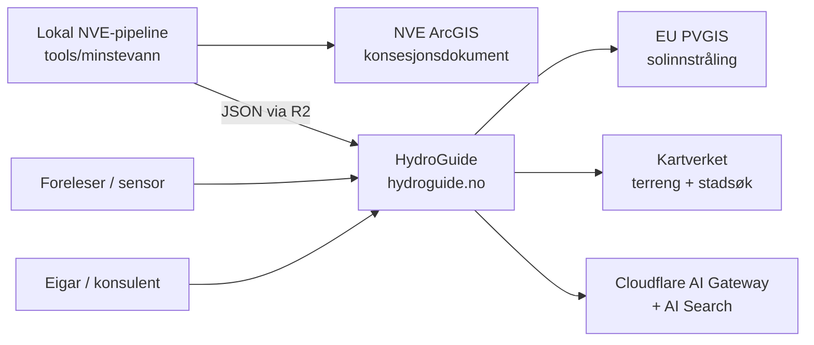
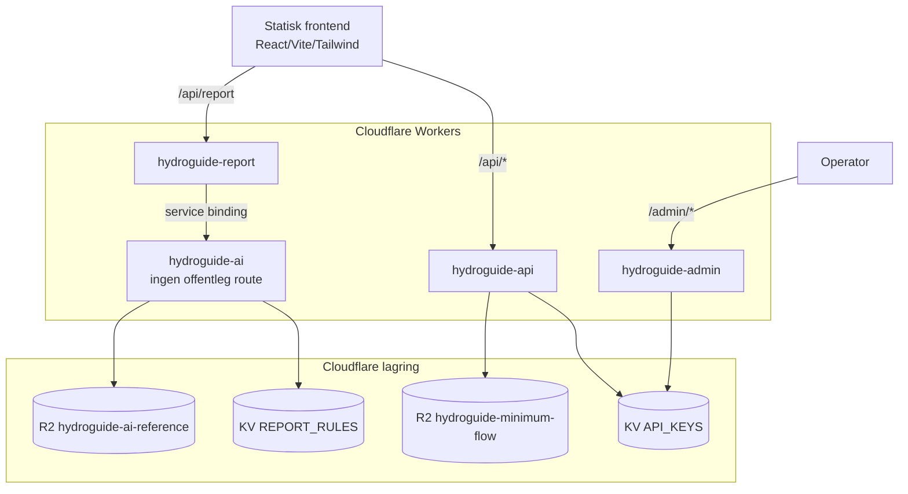

# HydroGuide Arkitektur

Oppdatert: 2026-05-03

HydroGuide er delt i tre hovuddelar:

1. Ein statisk React/Vite-frontend på `hydroguide.no`.
2. Fire Cloudflare Workers med tydelege ansvar.
3. Ein lokal NVE-pipeline som byggjer minstevassføring-data.

## Systemkontekst



HydroGuide kallar fire eksterne tenester i runtime: PVGIS for soldata, Kartverket for terreng og stadsøk, og Cloudflare AI Gateway/Search for rapport-AI. NVE-data hentes ikkje direkte frå Cloudflare — pipeline-en køyrer lokalt og legg ferdig JSON i R2.

## Container-Diagram



`hydroguide-ai` har ingen offentleg route. Nettsida kallar `hydroguide-report`.

## Lagring

| Lagring | Namn | Bruk |
|---------|------|------|
| KV | `API_KEYS` | API-nøklar, status og rate limit |
| KV | `REPORT_RULES` | Rapportreglar og faste utdrag |
| R2 | `hydroguide-minimum-flow` | `api/minimumflow.json` for NVEID-ruter |
| R2 | `hydroguide-ai-reference` | NVE-referansar og embeddings |
| R2 | `hydroguide-assets` | Offentlege filer under `files.hydroguide.no` |

## Dataflyt

### Bereknings-API

```text
Kunde eller app
  -> POST /api/calculations  (Bearer api-key)
  -> hydroguide-api
  -> API_KEYS (HMAC-verifisering, rate limit-teljing)
  -> calculation core
  -> JSON-respons
```

### Minstevassføring

```text
Lokal pipeline
  -> backend/data/minimumflow.json
  -> R2 hydroguide-minimum-flow
  -> GET /api/nveid/{nveID}/minimum-flow
```

Rotrutene for NVEID viser meny og neste steg, ikkje hele datasettet.

### Rapport

```text
Frontend
  -> POST /api/report  (REPORT_ACCESS_CODE_HASH)
  -> hydroguide-report
       - validerer access code
       - service binding REPORT_AI_WORKER (REPORT_WORKER_TOKEN)
  -> hydroguide-ai
       - retrieval frå REPORT_RULES + AI_REFERENCE_BUCKET
       - prompt-bygg
       - kall via AI Gateway (cache, retry)
       - rapporttekst
  -> Frontend renderar HTML-rapport
```

### Admin

```text
Operator
  -> /admin/keys (Bearer ADMIN_TOKEN)
  -> hydroguide-admin
  -> API_KEYS
```

Admin-ruter ligg under `/admin/*` og er aldri blanda med `/api/*`.

## Tekniske Val

| Val | Vi gjorde | Kvifor |
|-----|-----------|--------|
| Fleire Workers vs éin monolitt | Fire Workers (api, report, ai, admin) | Skild trust-grenser. Admin-kompromittering når ikkje rapport-AI. AI-Worker har ingen offentleg URL. |
| AI-tilgang frå nettside | Service binding `REPORT_AI_WORKER`, ikkje direkte HTTP | AI-Worker treng aldri offentleg route. Fewer angrepsflater. |
| Lagring av minstevassføring | R2-objekt med statisk JSON | ~600 NVEID-ar, oppdaterast sjeldan, oppslag på primærnøkkel — D1 er overkill. |
| Verifisering av API-nøklar | HMAC-hash i KV | Lekka KV-dump gir ikkje brukbare nøklar. |
| AI-pipeline for NVE-PDF | Lokalt, ikkje Worker | OCR + LLM-batch tek minutt — Workers har 30s CPU-grense. |
| Frontend-routing | Statisk SPA med React Router | Statisk frontend-hosting, ingen SSR-behov. |
| Public API-format | REST + OpenAPI på `/api/docs?ui` | Standard, lett å dokumentere, lett å teste i browser. |
| Cache-policy | Bypass for `/api/*` og `/admin/*` | Auth-state og rate-limit må vere fersk. Statisk frontend cachar normalt. |

## Eksterne Avhengigheiter

| Tenest | Bruk | Feil-handtering |
|--------|------|------------------|
| NVE ArcGIS | Konsesjonsdokument til pipeline | Pipeline-tid, ikkje runtime |
| EU PVGIS | TMY-soldata for solanalyse | Frontend viser feilmelding om proxy mistar tilgang |
| Kartverket terreng | Horisontprofil + radiolink | Frontend degraderer til åtvaring |
| Kartverket stadsøk | Autocomplete | Frontend tillét manuell innskriving |
| Cloudflare AI Gateway | LLM-kall i rapport | `gpt-5.4-mini` fallback, cache-treff reduserer behov |
| Cloudflare AI Search | Retrieval over `AI_REFERENCE_BUCKET` | Faste utdrag i `REPORT_RULES` som siste lag |

## Kva Dette Dokumentet Ikkje Dekkjer

| Detalj | Sjå |
|--------|-----|
| Konkrete endepunkt og handler-filer | [backend-dokumentasjon.md](backend-dokumentasjon.md) |
| Worker-bindingar, secrets, deploy-flyt | [cloudflare-dokumentasjon.md](cloudflare-dokumentasjon.md) |
| Trusselbilete og forsvar i lag | [sikkerheit.md](sikkerheit.md) |
| Frontend-struktur og brukarflyt | [frontend.md](frontend.md) |
| Rapport-AI runtime og retrieval | [ai-rapport.md](ai-rapport.md) |
| AI-strategi (hallusinering, kostnad, prompt) | [ai-strategi.md](ai-strategi.md) |
| Lokal utvikling | [utvikling.md](utvikling.md) |
| Beslutningar tatt under utvikling | `.ai/agent-worklog.md` |
