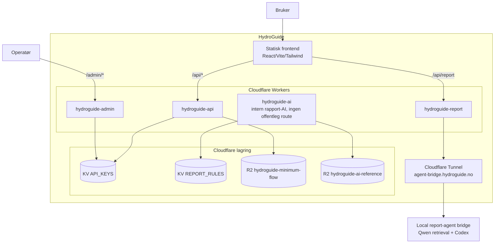
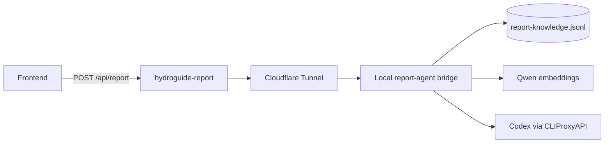
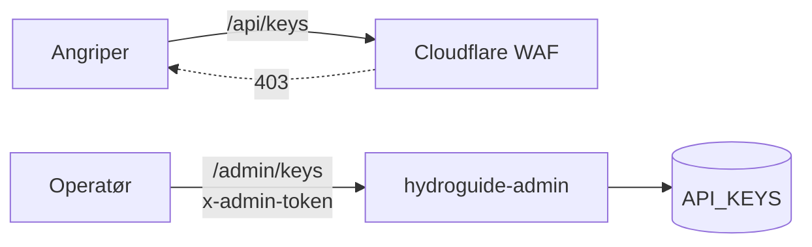

# HydroGuide arkitektur

Oppdatert: 2026-05-03

## Systemkontekst

HydroGuide består av en statisk frontend, fire Cloudflare Workers og fire lagringsenheter (to KV-namespaces, to R2-buckets). Workers er delt etter trust-grenser: offentlig API, rapport-mottak, intern AI uten offentlig route, og en isolert admin-Worker.

## Hovedkomponenter

| Komponent | Hva den gjør |
|-----------|--------------|
| Statisk frontend | React/Vite-app som kjører i nettleseren. Kalles direkte av brukeren via `hydroguide.no`. |
| `hydroguide-api` | Tar imot offentlige `/api/*`-kall: beregninger, NVEID-data, PVGIS-proxy, frontend-hjelpere. |
| `hydroguide-report` | Tar imot rapport-forespørsler fra nettsiden, validerer access code og videresender til lokal rapportagent via Cloudflare Tunnel. |
| `hydroguide-ai` | Intern rapport-AI uten offentlig URL. |
| `hydroguide-admin` | Håndterer API-nøkler på `/admin/*`. Skilt ut for å holde admin-overflaten unna det offentlige API-et. |
| `API_KEYS` (KV) | Hash av API-nøkler (HMAC), aktiv-status, rate-limit-tellere. |
| `REPORT_RULES` (KV) | Faste regler og NVE-utdrag for rapport-AI. |
| `hydroguide-minimum-flow` (R2) | `api/minimumflow.json` med minstevannføring per NVEID. |
| `hydroguide-ai-reference` (R2) | NVE-referanser og embeddings for AI-Search retrieval. |

## Rapport-flyten

Rapport-flyten går gjennom `hydroguide-report` og en lokal rapportagent. `hydroguide-report` validerer access code fra nettsiden, rate-limiter og kaller en stabil Cloudflare Tunnel med bearer-token. Den lokale bridgen henter rapportkunnskap fra JSONL, bruker lokale Qwen-embeddings til retrieval og kaller Codex via CLIProxyAPI.

Detaljer om lokal bridge og runtime: [../tools/agent-bridge/README.md](../tools/agent-bridge/README.md).

## Admin-isolasjon

Admin-Worker kjører separat på `/admin/*`. Cloudflare WAF blokkerer `/api/keys*` med 403 på sone-nivå. Offentlig API, rapportinngang og admin ligger i hver sin Worker.

For trusselbilde og auth-design: [sikkerheit.md](sikkerheit.md).

## Hovedflyt for kall

| Hva brukeren gjør | Hvilken Worker som svarer | Hvilke ressurser brukes |
|-------------------|---------------------------|--------------------------|
| Åpner `hydroguide.no` | Statisk frontend (Cloudflare CDN) | Ingen Worker |
| Henter NVEID-data | `hydroguide-api` | R2 `hydroguide-minimum-flow` |
| Beregner energibalanse | `hydroguide-api` | KV `API_KEYS` (auth + rate limit) |
| Lager rapport | `hydroguide-report` → lokal report-agent bridge | JSONL-kunnskap, Qwen embeddings, Codex via CLIProxyAPI |
| Administrerer API-nøkler | `hydroguide-admin` | KV `API_KEYS` |

## Tekniske valg

| Valg | Løsning | Begrunnelse |
|------|-----------|---------|
| Flere Workers vs én monolitt | Fire Workers (api, report, ai, admin) | Skilte trust-grenser. Admin-kompromittering når ikke rapportagenten. AI-Worker har ingen offentlig URL. |
| AI-tilgang fra nettside | `hydroguide-report` via Cloudflare Tunnel og bearer-token | Nettsiden kaller bare `/api/report`; lokal bridge krever internt token. |
| Lagring av minstevannføring | R2-objekt med statisk JSON | ~600 NVEID-er, sjeldne oppdateringer og oppslag på primærnøkkel. |
| Verifisering av API-nøkler | HMAC-hash i KV | Lekket KV-dump gir ikke brukbare nøkler. |
| AI-pipeline for NVE-PDF | Lokalt, ikke Worker | OCR + LLM-batch tar minutter — Workers har 30s CPU-grense. |
| Frontend-routing | Statisk SPA med React Router | Statisk frontend-hosting, ingen SSR-behov. |
| Public API-format | REST + API-side på `/api`, OpenAPI-spek på `/api/openapi` | Standard API-format med nettleserbasert dokumentasjon inne i appen. |
| Cache-policy | Bypass for `/api/*` og `/admin/*` | Auth-state og rate-limit må være ferskt. Statisk frontend caches normalt. |

## Eksterne avhengigheter

| Tjeneste | Bruk | Feilhåndtering |
|----------|------|------------------|
| NVE ArcGIS | Konsesjonsdokument til pipeline | Kun pipeline-tid, ikke runtime |
| EU PVGIS | API-proxy for eksterne soldata | Kall feiler kontrollert hvis proxy mister tilgang |
| Kartverket terreng | Radiolink og terrenghjelpere | Frontend degraderer til advarsel |
| Kartverket stedssøk | Autocomplete | Frontend tillater manuell innskriving |
| CLIProxyAPI | Codex-kall i rapport | Lokal bridge feiler kontrollert hvis Codex ikke er tilgjengelig |
| Lokale Qwen embeddings | Retrieval over `report-knowledge.jsonl` | Lokal bridge kan hente relevante kunnskapschunker uten OpenAI API-key |

## Hva dette dokumentet ikke dekker

| Detalj | Se |
|--------|-----|
| Konkrete endepunkter og handler-filer | [backend-dokumentasjon.md](backend-dokumentasjon.md) |
| Worker-bindinger, secrets, deploy-flyt | [cloudflare-dokumentasjon.md](cloudflare-dokumentasjon.md) |
| Trusselbilde og forsvar i lag | [sikkerheit.md](sikkerheit.md) |
| Frontend-struktur og brukerflyt | [frontend.md](frontend.md) |
| Lokal rapportagent | [../tools/agent-bridge/README.md](../tools/agent-bridge/README.md) |
| AI-strategi (modellrolle, kostnad, prompt) | [ai-strategi.md](ai-strategi.md) |
| Lokal utvikling | [utvikling.md](utvikling.md) |
