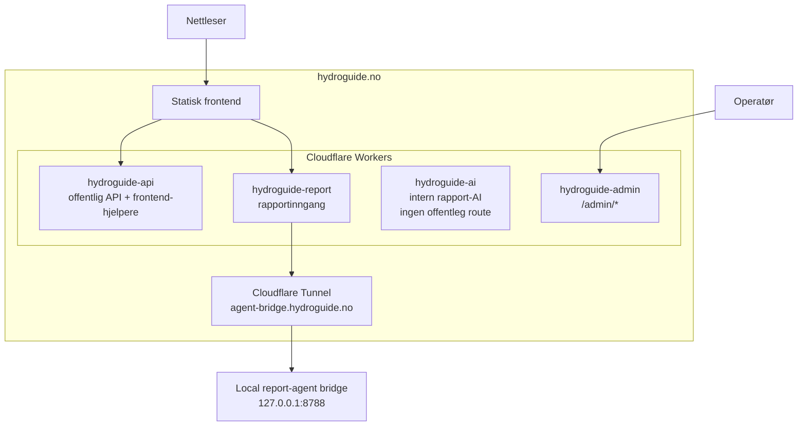
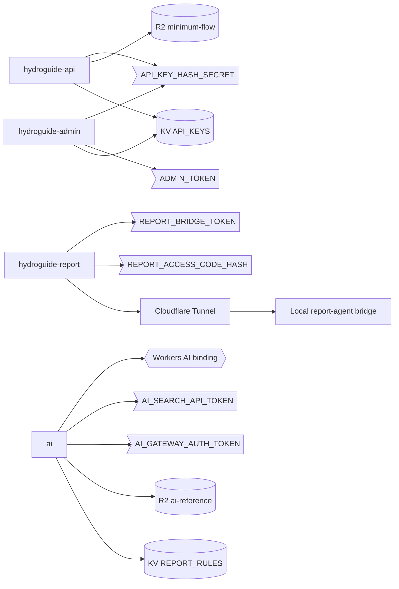
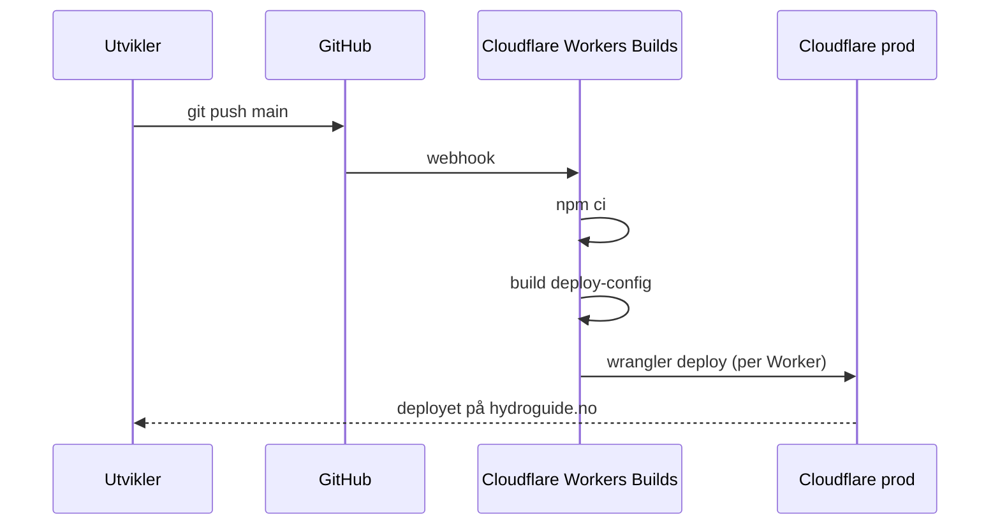

# Cloudflare-dokumentasjon

Oppdatert: 2026-05-03

## Kort forklart

Cloudflare-løsningen er delt i statisk frontend, fire Workers, to KV-namespaces og tre R2-buckets.



Cloudflare WAF avviser API-prefikser utenfor kontrakten, kildeprober og sensitive filstier som `/rest/*`, `/api/v1/*`, `/api/keys*`, `.env`, `.secrets`, `/.git*`, `/.ai*`, `/backend*` og `/node_modules*`.

## Hva nettsiden kaller direkte

| Rute | Worker | Bruk |
|------|--------|------|
| `/api/health` | `hydroguide-api` | Enkel helsesjekk |
| `/api` | Statisk frontend | API-dokumentasjon inne i HydroGuide |
| `/api/openapi` | `hydroguide-api` | OpenAPI-spek for API-siden |
| `/api/calculations` | `hydroguide-api` | Offentlig beregnings-API |
| `/api/NVEID/{id}` | `hydroguide-api` | Offentlig minstevannføring for én stasjon |
| `/api/pvgis-tmy` | `hydroguide-api` | PVGIS TMY-proxy |
| `/api/place-suggestions` | `hydroguide-api` | Stedssøk for appen |
| `/api/terrain-profile` | `hydroguide-api` | Terrengprofil for appen |
| `/api/report` | `hydroguide-report` | AI-tekst til rapporten |

WAF avviser `/api/keys*`. Admin for API-nøkler ligger på `/admin/keys`.

`/api/place-suggestions`, `/api/terrain-profile` og `/api/report` er frontend-hjelpere.

## Workers

| Worker | Config | Source | Bindinger |
|--------|--------|--------|-----------|
| `hydroguide-api` | `backend/cloudflare/api.wrangler.jsonc` | `backend/workers/api/index.js` | `MINIMUM_FLOW_BUCKET`, `API_KEYS`, `API_KEY_HASH_SECRET` |
| `hydroguide-report` | `backend/cloudflare/report.wrangler.jsonc` | `backend/workers/report/index.js` | `REPORT_BRIDGE_URL`, `REPORT_ACCESS_CODE_HASH`, `REPORT_BRIDGE_TOKEN` |
| `hydroguide-ai` | `backend/cloudflare/ai.wrangler.jsonc` | `backend/workers/ai/index.ts` | `AI`, `REPORT_RULES`, `AI_REFERENCE_BUCKET`, `REPORT_WORKER_TOKEN`, AI Gateway/Search secrets |
| `hydroguide-admin` | `backend/cloudflare/admin.wrangler.jsonc` | `backend/workers/admin/index.js` | `API_KEYS`, `ADMIN_TOKEN`, `API_KEY_HASH_SECRET` |

Alle Workers har `workers_dev: false`. Det hindrer en ekstra `*.workers.dev`-inngang som kan gå utenom sone-regler på `hydroguide.no`. Alle har også `observability.enabled: true` med full sampling, slik at runtime-logger kan leses i Cloudflare-dashbordet.

### Bindinger per Worker



`>...]` er secrets, `[(...)]` er KV/R2-lagring, `{{...}}` er native Cloudflare-binding. Cloudflare Tunnel peker til en lokal bridge på PC-en og bridge-tokenet begrenser hvem som kan kalle rapportgenereringen.

## Lagring

| Type | Navn | Bruk |
|------|------|------|
| R2 | `hydroguide-minimum-flow` | `api/minimumflow.json` for `/api/NVEID/{id}` |
| R2 | `hydroguide-ai-reference` | NVE-referanser og embeddings for rapport-AI |
| R2 | `hydroguide-assets` | Offentlige filer under `files.hydroguide.no` |
| KV | `API_KEYS` | API-nøkler, status og rate limit |
| KV | `REPORT_RULES` | Rapportregler, faste utdrag og retrieval-støtte |

## Hemmelige verdier

Disse ligger som Cloudflare secrets, Cloudflare Secrets Store eller Cloudflare Workers Builds secrets:

- `API_KEY_HASH_SECRET`
- `REPORT_ACCESS_CODE_HASH`
- `REPORT_BRIDGE_TOKEN`
- `REPORT_WORKER_TOKEN`
- `AI_GATEWAY_AUTH_TOKEN`
- `AI_SEARCH_API_TOKEN`
- `ADMIN_TOKEN`

`CLOUDFLARE_API_TOKEN` og `CLOUDFLARE_API_TOKEN_ID` ligger i Cloudflare Secrets Store og i lokal `.secrets` som backup. Aktiv driftstoken er en smal HydroGuide Cloudflare ops-token.

## Deploy-konfig

Kildekonfig ligger i `backend/cloudflare/*.wrangler.jsonc`. Disse filene bruker placeholder-IDer.

Genererte deploy-konfiger ligger som `backend/cloudflare/*.generated.wrangler.jsonc` og er gitignored. Scriptet lager dem:

```bash
node backend/scripts/build-cloudflare-worker-config.mjs --write-public
node backend/scripts/build-cloudflare-worker-config.mjs --write-deploy-config
```

Sjekk at offentlig metadata og deploy-konfig er konsistente:

```bash
node backend/scripts/build-cloudflare-worker-config.mjs --check-public
node backend/scripts/build-cloudflare-worker-config.mjs --check-deploy-config
```

Worker-endringer skal starte fra oppdatert `main`, på egen branch. For commit eller PR skal denne sjekken passere:

```bash
node backend/scripts/check-worker-hygiene.mjs --staged
```

Sjekken kjører offentlig config-validering, deploy-config-validering når private verdier finnes lokalt, stopper `*.generated.wrangler.jsonc` og private Cloudflare deploy-filer fra vanlig commit, og blokkerer staget Worker-endringer dersom branch er bak upstream. CI kjører samme sjekk med `--all --ci`.

## Deploy-flyt

Cloudflare Workers Builds er Git-koblet deploy for Workers. GitHub Actions deployer ikke Workers og skal ikke ha `CLOUDFLARE_API_TOKEN`.



Hver Worker er koblet til GitHub-repoet `nikolsen1234-bit/hydroguide` i Cloudflare:

| Worker | Root directory | Build command | Deploy command |
|--------|----------------|---------------|----------------|
| `hydroguide-ai` | `frontend` | `npm ci && node ../backend/scripts/build-cloudflare-worker-config.mjs --check-public --write-deploy-config` | `npx wrangler deploy --config ../backend/cloudflare/ai.generated.wrangler.jsonc` |
| `hydroguide-api` | `frontend` | `npm ci && node ../backend/scripts/build-cloudflare-worker-config.mjs --check-public --write-deploy-config` | `npx wrangler deploy --config ../backend/cloudflare/api.generated.wrangler.jsonc` |
| `hydroguide-report` | `frontend` | `npm ci && node ../backend/scripts/build-cloudflare-worker-config.mjs --check-public --write-deploy-config` | `npx wrangler deploy --config ../backend/cloudflare/report.generated.wrangler.jsonc` |
| `hydroguide-admin` | `frontend` | `npm ci && node ../backend/scripts/build-cloudflare-worker-config.mjs --check-public --write-deploy-config` | `npx wrangler deploy --config ../backend/cloudflare/admin.generated.wrangler.jsonc` |

Cloudflare Workers Builds har disse build-verdiene på Cloudflare-siden:

- `CLOUDFLARE_ACCOUNT_ID`
- `KV_API_KEYS_NAMESPACE_ID`
- `KV_REPORT_RULES_NAMESPACE_ID`

Cloudflare sin Workers Builds API-token håndterer deploy-kallet. Lokal `.secrets` er backup for manuell drift og lokal verifisering.

Deploy-rekkefølgen er:

1. `hydroguide-ai`
2. `hydroguide-api`
3. `hydroguide-report`
4. `hydroguide-admin`

`hydroguide-report` bruker `REPORT_BRIDGE_URL` og `REPORT_BRIDGE_TOKEN` for å nå den lokale rapportagenten. `hydroguide-ai` har ingen offentlig route og brukes ikke av den aktive rapportflyten.

## Rollback

Cloudflare Workers Builds holder tilgjengelig flere versjoner av hver Worker. Rollback skjer på Cloudflare-dashbordet under "Deployments" for den aktuelle Worker-en — velg en annen deploy og aktiver den. Samme rollback kan også gjøres lokalt med:

```bash
cd frontend
npx wrangler rollback --name hydroguide-api
```

For en dårlig konfig-endring som ikke er deployet enda: revert commit på `main`, push på nytt, så bygger Workers Builds en ny deploy med den forrige konfigen.

## Observability

| Kilde | Bruk |
|--------|------|
| Cloudflare Dashboard → Workers → `<worker>` → Logs | Live-logger med `head_sampling_rate: 1` |
| `npx wrangler tail --name <worker>` | Live-loggstream lokalt |
| Cloudflare Dashboard → Workers Builds | Bygg- og deploy-historikk per Worker |
| Cloudflare Dashboard → Analytics → Security | WAF-treff, rate limit-treff, blokkerte requests |
| Lokal CLIProxyAPI / agent-bridge-logg | Modellstatus, retrieval-backend, request-id og valgte kunnskapschunker for rapport |

Alle fire Workers har `observability.enabled: true`. Det betyr at alle requests blir logget med headere, status og runtime-feil uten ekstra kode i hver Worker.

## Sikkerhetsregler

- Admin-ruter ligger under `/admin/*`.
- WAF avviser `/api/keys*`. Adminoperasjoner går gjennom `/admin/keys`.
- Rapportagenten har ingen direkte offentlig report-route. `hydroguide-report` kaller den via Cloudflare Tunnel med `REPORT_BRIDGE_TOKEN`.
- Rapportkall bruker `REPORT_ACCESS_CODE_HASH` fra nettsiden og `REPORT_BRIDGE_TOKEN` internt.
- API-nøkler ligger i KV som hash/HMAC.
- R2-bucket for minstevannføring er skilt fra R2-bucket for AI-referanser.
- Tracked config bruker placeholders for account-IDer, namespace-IDer og tokens.

Aktive Cloudflare-regler:

- SSL/TLS: `strict`, Always Use HTTPS på, Automatic HTTPS Rewrites på, TLS 1.3 på, minimum TLS 1.2.
- DNSSEC: aktiv.
- WAF custom rules: avviser API-prefikser utenfor kontrakten, kilde-/secret-prober, `TRACE`/`TRACK`, og feil metoder mot admin.
- Managed WAF: Cloudflare Managed Free Ruleset er aktiv.
- Rate limit: `/api/*` og `/admin/*` er begrenset til plan-tillatt regel, 40 requests per 10 sekunder per IP/datasenter med 10 sekund blokk.
- Response headers: Cloudflare setter `Content-Security-Policy`, `X-Frame-Options`, `Referrer-Policy` og `Permissions-Policy`.
- Cache rules: Cloudflare bypasser cache for `/api/*` og `/admin/*`; statisk frontend og R2-assets er utenfor denne API/admin-bypassregelen.

## Tokenhygiene

- Cloudflare secrets er primær kilde for drift. Lokal `.secrets` er backup med samme verdier.
- Den aktive Cloudflare ops-tokenen har HydroGuide-relevante rettigheter for Workers, routes, KV, R2, Secrets Store, zone settings, WAF, transform rules, cache rules, DNS og SSL.
- Tokener som blir limt inn i chat eller brukt utenfor normal drift blir rotert etter bruk.

## Se også

- Sikkerhetsmodell og trusselbilde: [sikkerheit-dokumentasjon.md](sikkerheit-dokumentasjon.md)
- Arkitektur og dataflyt: [arkitektur-dokumentasjon.md](arkitektur-dokumentasjon.md)
- Lokal utvikling og bygg: [utvikling-dokumentasjon.md](utvikling-dokumentasjon.md)
- Backend-kode og endepunkter: [backend-dokumentasjon.md](backend-dokumentasjon.md)
- Lokal rapportagent: [../tools/agent-bridge/README.md](../tools/agent-bridge/README.md)
