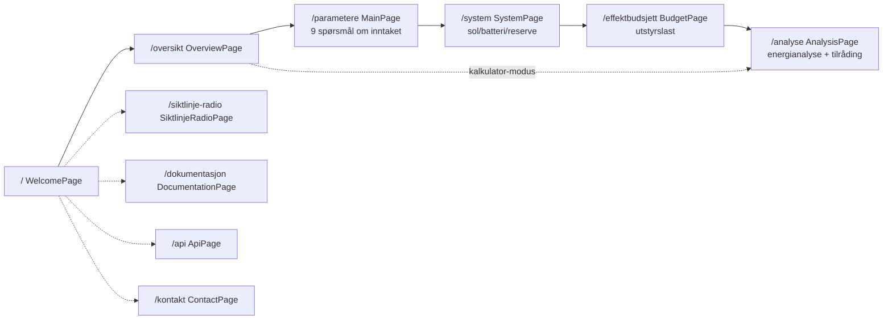

# Frontend-Dokumentasjon

Oppdatert: 2026-05-03

Frontend er React/Vite-appen for `hydroguide.no`. Han brukar TypeScript, Tailwind, React Router og Leaflet. Teksten er nynorsk med engelsk som alternativ.

## Brukarflyt



Hovudflyten er "5-trinns konfigurasjon": Velkomst → Oversikt → Parameter → System → Budsjett → Analyse. Sidesporene (radiolink, dokumentasjon, API, kontakt) er tilgjengelege heile tida.

## Sider

| Side | Rute | Kjelde | Beskrivelse |
|------|------|--------|-------------|
| `WelcomePage` | `/` | `frontend/src/pages/WelcomePage.tsx` | Landingsside og modusveljar |
| `OverviewPage` | `/oversikt` | `OverviewPage.tsx` | Samandrag av konfigurasjon |
| `MainPage` | `/parametere` | `MainPage.tsx` | Spørsmål Q1-Q9 om inntaket |
| `SystemPage` | `/system` | `SystemPage.tsx` | Sol, batteri, reservekraft |
| `BudgetPage` | `/effektbudsjett` | `BudgetPage.tsx` | Utstyrsbudsjett, effekt og forbruk |
| `AnalysisPage` | `/analyse` | `AnalysisPage.tsx` | Energianalyse time for time, tilråding |
| `SiktlinjeRadioPage` | `/siktlinje-radio` | `SiktlinjeRadioPage.tsx` | Siktlinje og Fresnel-sone for radiolink |
| `DocumentationPage` | `/dokumentasjon` | `DocumentationPage.tsx` | Teknisk bakgrunn med formlar |
| `ContactPage` | `/kontakt` | `ContactPage.tsx` | Prosjektgruppe og kontakt |
| `ApiPage` | `/api` | `ApiPage.tsx` | Innebygd visning av offentleg API |

## Tilstand

Brukarvalgene lever i éin React Context-modul:

- `frontend/src/context/ConfigurationContext.tsx` — multi-config state-maskin. Tek vare på fleire parallelle konfigurasjonar slik at brukaren kan samanlikne scenario.
- `frontend/src/i18n/LanguageContext.tsx` — språkval (nynorsk eller engelsk).

Konfigurasjonane blir persistert til `localStorage`, slik at refresh midt i ein analyse ikkje mister data. Når ein ny konfigurasjon blir oppretta, får han eigen ID, og rute-state held styr på kva konfig som er aktiv.

## Komponentlag

Felles komponentar i `frontend/src/components/` (gjenbrukt på fleire sider):

| Komponent | Bruk |
|-----------|------|
| `FormFields.tsx` | `SelectField`, `NumberField`, `JaNeiField` osv. — felles input-stil |
| `WorkspaceHeader.tsx`, `WorkspaceSection.tsx`, `WorkspaceActions.tsx` | Standard side-layout |
| `SystemCharts.tsx`, `ReliabilityCharts.tsx`, `HorizonChart.tsx`, `SolarPositionChart.tsx` | Eigenutvikla SVG-diagram (ingen chart-bibliotek) |
| `RadioLinkMap.tsx`, `NveStandaloneMap.tsx`, `PanoramicHorizon.tsx` | Kartvisningar |
| `ImportDropZone.tsx` | Import av lagra konfigurasjon |
| `BuildInfoBadge.tsx` | Synleg build-versjon (genererast av `prebuild`-script) |
| `HydroGuideLogo.tsx` | Logo |

Felles Tailwind-klassar er sentralisert i `frontend/src/styles/`.

## Spørsmål Og Anbefaling

Brukaren svarar på ni spørsmål om inntaket. Logikken som tolkar svara og foreslår løysing for slepp og måling ligg i `frontend/src/utils/recommendation.ts`.

Vassføringsgrenser:

- liten: opp til 30 l/s
- middels: opp til 120 l/s
- stor: over 120 l/s

## Berekningsmodular

Berekningane er delt opp etter ansvar. Same modulnamn er brukt konsekvent i `frontend/src/utils/`.

### Modusar

| Modus | Beskrivelse |
|-------|-------------|
| Rask | Forenkla månadsmodell med lokale standardverdiar |
| Detaljert | Timesvis simulering med soldata, batteri og pålitelegheitsanalyse |
| Kombinert | Forenkla oversikt + detaljert pålitelegheitsanalyse |

### Solstråling

Reknar ut kor mykje sol som treffer panelet kvar time gjennom året. Modellen tek omsyn til solposisjon, horisontskugge, panelvinkel, modultemperatur og verkningsgrad. Klimadata kjem frå EU sitt PVGIS-arkiv via proxyen `/api/pvgis-tmy`.

Implementert i `solarEngine.ts` med data frå `metClient.ts`.

### Horisontprofil

Hentar høgdedata for terrenget rundt staden frå Kartverket og brukar dei til å rekne ut når sola står bak ein åskam.

Implementert i `horizonProfile.ts`. Han samplar 360 retningar og 40 avstandar frå Kartverkets terrengmodell.

### Batterisimulering

Simulerer batteriet time for time gjennom eit heilt år. Resultatet viser lagra energi, brukt energi, tomt batteri, behov for reservekraft og drivstoffkostnad.

Implementert i `batterySimulator.ts`.

### Energibalanse

Summerer utstyrsbudsjettet, dimensjonerer batteriet, samanliknar sol mot last månad for månad, og reknar ut årstotalar for energi, drivstoff og CO2. Han samanliknar òg totalkostnaden over levetida mellom reservekjeldene.

Implementert i `systemResults.ts`. Same modul finst i `backend/services/calculations/` slik at API og frontend brukar éin felles berekningskjerne.

### Radiolink

Reknar ut om to punkt har fri sikt for trådlaust samband, og om Fresnel-sona er klar. Terrengprofilen mellom punkta blir henta frå Kartverket.

Implementert i `radioLink.ts`.

## Standalone-Kart

Det finst to statiske HTML-kart utanfor React-treet:

- `frontend/public/nve-kart-standalone.html` — NVE-kart over vasskraftverk med minstevassføring, Wikipedia-bilete og lenker til konsesjonsdokument.
- `frontend/public/solar-location-map.html` — Lokasjonskart for solanalyse. Sender koordinatar tilbake til React med `postMessage`.

**Kvifor standalone i staden for React-komponent:** karta brukar Leaflet med tunge plugins som er enklare å laste isolert utan å påverke bundle-storleik på resten av appen. `postMessage` gir reint api mellom iframe og React utan å dele tilstand.

## Internasjonalisering

Tekstar er definert i `frontend/src/i18n/`:

- `nn.ts` — nynorsk (default)
- `en.ts` — engelsk
- `types.ts` — typebeskriving av nøklar
- `dynamicStrings.ts` — runtime-genererte tekstar (eks. tabellrad-overskrifter)
- `LanguageContext.tsx` — runtime-veljar

UI-språk er nynorsk. Engelsk er valgbart for sensor eller eksterne lesarar.

## Rapport

Frontend genererer ein HTML-rapport med diagram, kostnadssamanlikning, tilrådingar og AI-tekst som forklarar valet i klart språk.

Implementert i `report.ts`. AI-teksten kjem frå `POST /api/report` (sjå [ai-rapport.md](ai-rapport.md)).

## Bygg Og Deploy

```bash
cd frontend
npm ci              # installer nøyaktige låste pakkar
npm run dev         # Vite-utviklingstenar på localhost:5173
npm run build       # TypeScript-check + Vite-build til dist/
npm run build:test  # bygg og kopier til test-deploy/
```

Frontend blir deploya som statiske filer til Cloudflare. Workers-deploy går via Cloudflare Workers Builds (sjå [cloudflare-dokumentasjon.md](cloudflare-dokumentasjon.md)).

`scripts/update-build-info.mjs` køyrer som `prebuild` og legg inn build-versjon som `BuildInfoBadge` viser i UI.

## Lokal API-bridge

I `npm run dev`-modus mappar `vite.config.ts` `/api/*`-kall lokalt til handlarar i `backend/api/*.js`. Det gjer at frontend kan teste mot ekte handler-kode utan å deploye Workers. Bridge-rutene er definert i `vite.config.ts`.

For lokalt oppsett, krav og fellesfeil: sjå [utvikling.md](utvikling.md).

## Sjå Òg

- Endepunkt frontend kallar: [backend-dokumentasjon.md](backend-dokumentasjon.md)
- Rapport-AI: [ai-rapport.md](ai-rapport.md)
- Lokal utvikling: [utvikling.md](utvikling.md)
