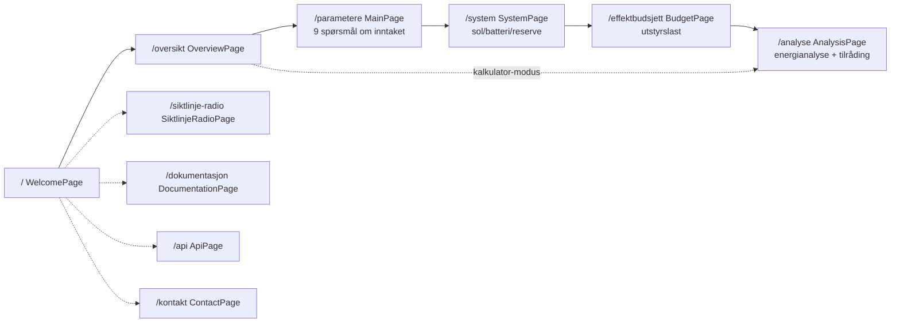

# Frontend-dokumentasjon

Oppdatert: 2026-05-03

Frontend er React/Vite-appen for `hydroguide.no`. Den bruker TypeScript, Tailwind, React Router og Leaflet. Teksten er nynorsk med engelsk som alternativ.

## Brukerflyt



Hovedflyten er "5-trinns konfigurasjon": Velkomst → Oversikt → Parameter → System → Budsjett → Analyse. Sidesporene (radiolink, dokumentasjon, API, kontakt) er tilgjengelige hele tiden.

## Sider

| Side | Rute | Kilde | Beskrivelse |
|------|------|--------|-------------|
| `WelcomePage` | `/` | `frontend/src/pages/WelcomePage.tsx` | Landingsside og modusvelger |
| `OverviewPage` | `/oversikt` | `OverviewPage.tsx` | Sammendrag av konfigurasjon |
| `MainPage` | `/parametere` | `MainPage.tsx` | Spørsmål Q1-Q9 om inntaket |
| `SystemPage` | `/system` | `SystemPage.tsx` | Sol, batteri, reservekraft |
| `BudgetPage` | `/effektbudsjett` | `BudgetPage.tsx` | Utstyrsbudsjett, effekt og forbruk |
| `AnalysisPage` | `/analyse` | `AnalysisPage.tsx` | Energianalyse time for time, tilråding |
| `SiktlinjeRadioPage` | `/siktlinje-radio` | `SiktlinjeRadioPage.tsx` | Siktlinje og Fresnel-sone for radiolink |
| `DocumentationPage` | `/dokumentasjon` | `DocumentationPage.tsx` | Teknisk bakgrunn med formler |
| `ContactPage` | `/kontakt` | `ContactPage.tsx` | Prosjektgruppe og kontakt |
| `ApiPage` | `/api` | `ApiPage.tsx` | Innebygd visning av offentlig API |

## Tilstand

Brukervalgene lever i én React Context-modul:

- `frontend/src/context/ConfigurationContext.tsx` — multi-config tilstandsmaskin. Tar vare på flere parallelle konfigurasjoner slik at brukeren kan sammenligne scenarier.
- `frontend/src/i18n/LanguageContext.tsx` — språkvalg (nynorsk eller engelsk).

Konfigurasjonene blir persistert til `localStorage`, slik at refresh midt i en analyse ikke mister data. Når en ny konfigurasjon blir opprettet, får den egen ID, og rute-state holder styr på hvilken konfig som er aktiv.

## Komponentlag

Felles komponenter i `frontend/src/components/` (gjenbrukt på flere sider):

| Komponent | Bruk |
|-----------|------|
| `FormFields.tsx` | `SelectField`, `NumberField`, `JaNeiField` osv. — felles input-stil |
| `WorkspaceHeader.tsx`, `WorkspaceSection.tsx`, `WorkspaceActions.tsx` | Standard sidelayout |
| `SystemCharts.tsx`, `ReliabilityCharts.tsx`, `HorizonChart.tsx`, `SolarPositionChart.tsx` | Egenutviklede SVG-diagrammer (ingen chart-bibliotek) |
| `RadioLinkMap.tsx`, `NveStandaloneMap.tsx`, `PanoramicHorizon.tsx` | Kartvisninger |
| `ImportDropZone.tsx` | Import av lagret konfigurasjon |
| `BuildInfoBadge.tsx` | Synlig build-versjon (genereres av `prebuild`-script) |
| `HydroGuideLogo.tsx` | Logo |

Felles Tailwind-klasser er sentralisert i `frontend/src/styles/`.

## Spørsmål og anbefaling

Brukeren svarer på ni spørsmål om inntaket. Logikken som tolker svarene og foreslår løsning for slipp og måling ligger i `frontend/src/utils/recommendation.ts`.

Vannføringsgrenser:

- liten: opptil 30 l/s
- middels: opptil 120 l/s
- stor: over 120 l/s

## Beregningsmoduler

Beregningene er delt opp etter ansvar. Samme modulnavn er brukt konsekvent i `frontend/src/utils/`.

### Modi

| Modus | Beskrivelse |
|-------|-------------|
| Rask | Forenklet månedsmodell med lokale standardverdier |
| Detaljert | Timesvis simulering med soldata, batteri og pålitelighetsanalyse |
| Kombinert | Forenklet oversikt + detaljert pålitelighetsanalyse |

### Solstråling

Regner ut hvor mye sol som treffer panelet hver time gjennom året. Modellen tar hensyn til solposisjon, horisontskygge, panelvinkel, modultemperatur og virkningsgrad. Klimadata kommer fra EU sitt PVGIS-arkiv via proxyen `/api/pvgis-tmy`.

Implementert i `solarEngine.ts` med data fra `metClient.ts`.

### Horisontprofil

Henter høydedata for terrenget rundt stedet fra Kartverket og bruker dem til å regne ut når sola står bak en åskam.

Implementert i `horizonProfile.ts`. Den sampler 360 retninger og 40 avstander fra Kartverkets terrengmodell.

### Batterisimulering

Simulerer batteriet time for time gjennom et helt år. Resultatet viser lagret energi, brukt energi, tomt batteri, behov for reservekraft og drivstoffkostnad.

Implementert i `batterySimulator.ts`.

### Energibalanse

Summerer utstyrsbudsjettet, dimensjonerer batteriet, sammenligner sol mot last måned for måned, og regner ut årstotaler for energi, drivstoff og CO2. Den sammenligner også totalkostnaden over levetiden mellom reservekildene.

Implementert i `systemResults.ts`. Samme modul finnes i `backend/services/calculations/` slik at API og frontend bruker én felles beregningskjerne.

### Radiolink

Regner ut om to punkter har fri sikt for trådløst samband, og om Fresnel-sonen er klar. Terrengprofilen mellom punktene blir hentet fra Kartverket.

Implementert i `radioLink.ts`.

## Standalone-kart

Det finnes to statiske HTML-kart utenfor React-treet:

- `frontend/public/nve-kart-standalone.html` — NVE-kart over vannkraftverk med minstevannføring, Wikipedia-bilder og lenker til konsesjonsdokument.
- `frontend/public/solar-location-map.html` — Lokasjonskart for solanalyse. Sender koordinater tilbake til React med `postMessage`.

**Hvorfor standalone i stedet for React-komponent:** kartene bruker Leaflet med tunge plugins som er enklere å laste isolert uten å påvirke bundle-størrelse på resten av appen. `postMessage` gir rent api mellom iframe og React uten å dele tilstand.

## Internasjonalisering

Tekster er definert i `frontend/src/i18n/`:

- `nn.ts` — nynorsk (default)
- `en.ts` — engelsk
- `types.ts` — typebeskrivelse av nøkler
- `dynamicStrings.ts` — runtime-genererte tekster (eks. tabellrad-overskrifter)
- `LanguageContext.tsx` — runtime-velger

UI-språk er nynorsk. Engelsk er valgbart for sensor eller eksterne lesere.

## Rapport

Frontend genererer en HTML-rapport med diagrammer, kostnadssammenligning, tilrådinger og AI-tekst som forklarer valget i klart språk.

Implementert i `report.ts`. AI-teksten kommer fra `POST /api/report` (se [ai-rapport.md](ai-rapport.md)).

## Bygg og deploy

```bash
cd frontend
npm ci              # installer nøyaktige låste pakker
npm run dev         # Vite-utviklingstjener på localhost:5173
npm run build       # TypeScript-check + Vite-build til dist/
npm run build:test  # bygg og kopier til test-deploy/
```

Frontend blir deployet som statiske filer til Cloudflare. Workers-deploy går via Cloudflare Workers Builds (se [cloudflare-dokumentasjon.md](cloudflare-dokumentasjon.md)).

`scripts/update-build-info.mjs` kjører som `prebuild` og legger inn build-versjon som `BuildInfoBadge` viser i UI.

## Lokal API-bridge

I `npm run dev`-modus mapper `vite.config.ts` `/api/*`-kall lokalt til handlere i `backend/api/*.js`. Det gjør at frontend kan teste mot ekte handler-kode uten å deploye Workers. Bridge-rutene er definert i `vite.config.ts`.

For lokalt oppsett, krav og fellesfeil: se [utvikling.md](utvikling.md).

## Se også

- Endepunkter frontend kaller: [backend-dokumentasjon.md](backend-dokumentasjon.md)
- Rapport-AI: [ai-rapport.md](ai-rapport.md)
- Lokal utvikling: [utvikling.md](utvikling.md)
