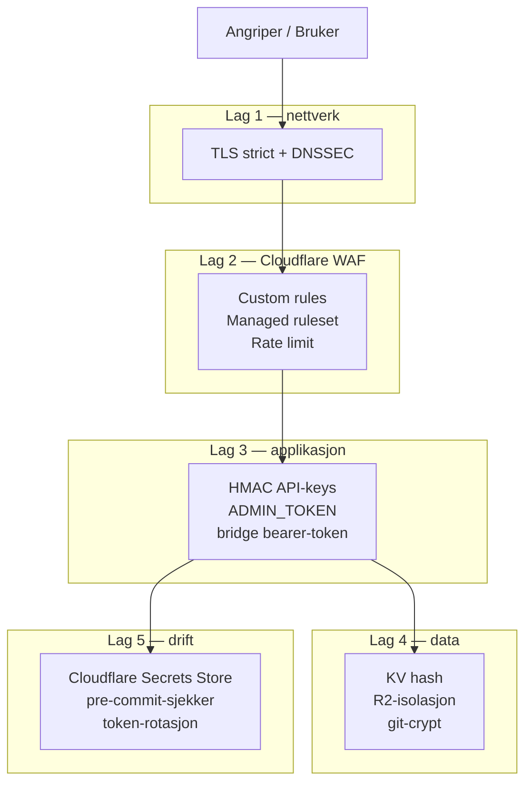

# Sikkerhet i HydroGuide

Oppdatert: 2026-05-03

Dette dokumentet svarer på "hva er trusselbildet, og hva har vi gjort for å motvirke det". Detaljerte WAF-regler, secrets og deploy-rutiner er i [cloudflare-dokumentasjon.md](cloudflare-dokumentasjon.md).

## Trusselbilde

Realistiske trusler vi har designet mot:

| # | Trussel | Relevans |
|---|---------|------------------|
| T1 | Stjålne eller lekkede API-nøkler | Offentlig `/api/calculations` bruker Bearer-nøkler |
| T2 | Lekket Cloudflare deploy-token | Full deploy-tilgang gir full kompromittering |
| T3 | Rute-skanning og kildeprobing | Standard angrep mot ethvert offentlig domene |
| T4 | Misbruk av admin-endepunkt fra utsiden | Key-administrasjon må ikke være offentlig |
| T5 | Direkte kall til intern AI-Worker | AI-token og prompts skal ikke være eksponert |
| T6 | Rate-misbruk og DOS av API | LLM-kall i rapport-AI er dyre per request |
| T7 | Prompt-injection via NVE-data eller brukertekst | Rapport-AI mottar tekst fra flere kilder |
| T8 | Klartekst-lagring av sensitive verdier i Git | Repoet er offentlig synlig |

## Forsvar i lag

Hvert lag fanger en annen klasse trusler. En angriper må komme gjennom alle relevante lag for å nå sensitive data — ingen enkelt-svikt gir full kompromittering.

### Lag 1 — nettverk og transport

- TLS-modus `strict` mot origin (Cloudflare→Workers).
- Always Use HTTPS og Automatic HTTPS Rewrites er på.
- TLS 1.3 er på, minimum TLS 1.2.
- DNSSEC er aktiv på `hydroguide.no`.

Motvirker: T3 (avlytting og protokoll-nedgradering).

### Lag 2 — Cloudflare WAF

| Type | Mål | Respons |
|------|-----|---------|
| Custom rule | `/rest/*`, `/api/v1/*` | 403 — prefiks utenfor kontrakten |
| Custom rule | `/api/keys*` | 403 — admin må gå via `/admin/keys` |
| Custom rule | `.env`, `.secrets`, `/.git*`, `/.ai*`, `/backend*`, `/node_modules*` | 403 — kilde- og secret-probing |
| Custom rule | `TRACE`, `TRACK`-metoder | 403 — kjent HTTP-metode-misbruk |
| Custom rule | `/admin/*` med feil metode | 403 — reduserer overflate på admin |
| Managed ruleset | Cloudflare Managed Free | OWASP-treff, blokk eller utfordring |
| Rate limit | `/api/*` og `/admin/*` | 40 req per 10s per IP/datasenter, 10s blokk |

Motvirker: T3, T4, T6.

### Lag 3 — applikasjon (Workers)

| Tiltak | Hvor |
|--------|-----|
| HMAC-hash av API-nøkler i KV (SHA-256, konstanttid-sammenligning) | `hydroguide-api` |
| `x-admin-token` med `ADMIN_TOKEN` for admin-operasjoner | `hydroguide-admin` |
| Cloudflare Tunnel med `REPORT_BRIDGE_TOKEN` | `hydroguide-report` -> lokal report-agent bridge |
| Lokal bridge binder til `127.0.0.1` | `tools/agent-bridge` |
| `REPORT_ACCESS_CODE_HASH` validerer at rapportkall kommer fra nettsiden | `hydroguide-report` |
| Skjemavalidering av request-body | `/api/calculations` |
| `workers_dev: false` på alle Workers | hindrer `*.workers.dev`-omgåing |
| Restriktiv CORS på rapportinngangen | bare `hydroguide.no` og lokal dev |

Motvirker: T1, T4, T5, T7 (delvis — se Lag 4).

### Lag 4 — data og lagring

- API-nøkler: bare hash-form i KV, aldri klartekst.
- R2-isolasjon: `hydroguide-minimum-flow` (offentleg lesbar via API) er skilt frå `hydroguide-ai-reference` (intern retrieval for rapportflyten). Kompromittering av éin bucket gir ikkje tilgang til den andre.
- `tools/agent-bridge/knowledge/report-knowledge.jsonl` inneholder faste regler og utdrag som legges inn i rapportagentens prompt etter lokal retrieval.
- Tracked Wrangler-config har placeholders, ikke ekte IDer eller namespace-IDer.
- Sensitive lokale filer (`.secrets`, `backend/config/cloudflare.private.json`) er kryptert med git-crypt.

Motvirker: T1 (lekkasje gir ikke brukbare nøkler), T2 (placeholders i stedet for token), T7 (faste regler i prompt), T8.

### Lag 5 — drift

- Cloudflare Secrets Store er primærkilde for tokens. Lokal `.secrets` er backup, kryptert med git-crypt.
- `check-worker-hygiene.mjs` kjører i pre-commit og CI. Den:
  - validerer offentlig config,
  - blokkerer commit av `*.generated.wrangler.jsonc`,
  - blokkerer commit av private deploy-filer,
  - krever oppdatert branch mot upstream før Worker-endring.
- `check-secrets.mjs` kjører i pre-commit og blokkerer kjente secret-mønstre.
- Token-rotasjon ved tvil: tokener som er limt inn i chat eller brukt utenfor vanlig drift.
- Cloudflare Workers Builds-token er smal: bare Workers + relaterte ressurser, ikke full account-tilgang.

Motvirker: T2, T8.

## Trussel-til-kontroll-mapping

| Trussel | Primærkontroll | Forsvar i dybden |
|---------|----------------|------------------|
| T1 stjålne API-nøkler | HMAC-hash i KV (Lag 3+4) | Rate limit (Lag 2), audit ved unormal bruk |
| T2 lekket deploy-token | Smal Workers Builds-token (Lag 5) | Cloudflare Secrets Store, lokal git-crypt (Lag 4+5) |
| T3 rute-skanning | WAF custom rules (Lag 2) | TLS-strict, DNSSEC (Lag 1) |
| T4 admin fra utsiden | Skilt Worker + WAF-blokk (Lag 2+3) | `ADMIN_TOKEN` (Lag 3) |
| T5 direkte AI-kall | `workers_dev: false` + ingen direkte report-route på lokal bridge (Lag 3) | `REPORT_BRIDGE_TOKEN` (Lag 3) |
| T6 rate-misbruk | Cloudflare rate limit (Lag 2) | Per-API-nøkkel rate limit i KV (Lag 3) |
| T7 prompt-injection | Faste utdrag i lokal report-knowledge JSONL (Lag 4) | Prosjektfelt behandles som data, JSON-output og validator (Lag 3) |
| T8 secrets i Git | git-crypt + placeholders (Lag 4+5) | `check-secrets.mjs` (Lag 5) |

## Kjente begrensninger

Kjente begrensninger:

- **Ingen audit-log per request på API-nøkkel-bruk.** Cloudflare-logg gir oss tidsstempel og status, men vi har ikke strukturert per-nøkkel-statistikk i KV.
- **Ingen automatisk secrets-rotasjon.** Token-rotasjon skjer manuelt ved mistanke.
- **Cloudflare Free-rate-limit er per datasenter, ikke globalt.** Distribuerte angrep fra mange Cloudflare-PoP-er kan komme over grensen lokalt uten å trigge global blokk.
- **Pipeline-LLM bruker JSON schema i LM Studio-kallet.** Output fra `tools/minstevann/` bør fortsatt manuelt spot-sjekkes ved upload til R2.
- **Rapportagenten har ikke rate limit per API-nøkkel ennå.** Cloudflare Worker-rate-limit dekker per IP, og lokal bridge kjører én generering om gangen.
- **Prompt-injection-mottiltak er instruksjonsisolasjon og validator, ikke full deteksjon.** Prosjektfelt behandles som data, men det finnes ikke en formell prompt-injection-detektor.
- **Ingen sikkerhetsbevis utover designet.** Vi har ikke kjørt formell pentest.

## Se også

- Detaljert WAF, secrets, deploy-flyt: [cloudflare-dokumentasjon.md](cloudflare-dokumentasjon.md)
- Hvordan rapportagent-flyten er bygget: [arkitektur-dokumentasjon.md](arkitektur-dokumentasjon.md)
- Rapport-AI og prompt-strategi: [ai-strategi-dokumentasjon.md](ai-strategi-dokumentasjon.md)
